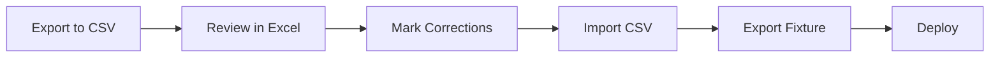

# Question Bank Management Guide

This guide explains all practical ways to manage questions in CrackCMS, with a fixture-first workflow for reliable production deploys.

## Current Source of Truth

- `backend/questions_fixture.json` is the production source for question bank data.
- `backend/build.sh` loads this fixture during deploy.
- If you add or edit questions in local DB, re-export the fixture and commit it.

## Quick Decision Table

- Use `Django Admin` when adding/editing a few questions manually.
- Use `Upload API` when importing many questions at once.
- Use `questions_fixture.json` when syncing data to production.

## Method 1: Add or Edit Questions in Django Admin (Recommended)

1. Start backend server.
2. Open `http://localhost:8000/admin/`.
3. Login as admin/superuser.
4. Go to `Questions`.
5. To add: click `Add Question`.
6. To edit: open existing question, update fields.
7. Save.

Required fields for each MCQ:

- `question_text`
- `option_a`
- `option_b`
- `option_c`
- `option_d`
- `correct_answer` (`A`/`B`/`C`/`D`)
- `year`
- `subject`

Recommended fields:

- `difficulty`
- `explanation`
- `topic`
- `mnemonic`
- `concept_tags`

After admin edits, run fixture export (see Method 4) so production gets the same data.

### Add Topic Form Template (CAP Example)

For question pattern: `Most common cause of Community Acquired Pneumonia` in UPSC CMS General Medicine.

Use Django Admin `Add Topic` values:

- `Name`: `Community Acquired Pneumonia (CAP)`
- `Parent`: `Respiratory System`
- `Importance`: `7`
- `Description`:

```text
Community Acquired Pneumonia (CAP) refers to pneumonia acquired outside hospital settings.
The most common causative organism is Streptococcus pneumoniae.
Other causes include Mycoplasma pneumoniae, Staphylococcus aureus, and Legionella pneumophila.
It is an important topic in General Medicine for UPSC CMS due to frequent MCQs on etiology and management.
```

Recommended hierarchy:

- `General Medicine`
- `Respiratory System`
- `Pneumonia`
- `Community Acquired Pneumonia (CAP)`

Recommended question concept tags for CAP:

- `community acquired pneumonia`
- `streptococcus pneumoniae`
- `pneumonia etiology`
- `respiratory infections`
- `typical pneumonia`

## Method 2: Add Questions via API (Single or Bulk)

Base endpoint:

- `POST /api/questions/` (single object)
- `POST /api/questions/upload/` (array of objects)

Authentication:

- Admin JWT required.

Example bulk payload for `/api/questions/upload/`:

```json
[
  {
    "question_text": "Most common cause of acute myocardial infarction is:",
    "option_a": "Coronary artery thrombosis",
    "option_b": "Coronary artery spasm",
    "option_c": "Aortic dissection",
    "option_d": "Coronary embolism",
    "correct_answer": "A",
    "year": 2025,
    "subject": 1,
    "topic": null,
    "concept_explanation": "ACS pathophysiology basics...",
    "mnemonic": "Rupture -> clot -> MI",
    "book_name": "Harrison",
  }
## Method 6: Fix Wrong Answers (Review & Correct Workflow)

**Use when**: You discover questions with incorrect `correct_answer` values that need systematic correction.

### The Problem

Some questions in the database (especially older years like 2018-2020) have wrong answer keys. For example:
- Question: "Characteristic feature of upper motor neuron lesion"
- Database shows: Answer = A (Fasciculations) ❌ WRONG
- Correct answer: C (Clonus) ✅ CORRECT

### Workflow Overview



### Step-by-Step Process

#### Step 1: Export Questions for Review

Export all questions from a specific year to CSV:

```bash
cd backend
python _review_and_fix_answers.py export --year 2018
```

This creates `questions_review_2018.csv` with columns:
- Question ID, Year, Subject, Topic
- Question Text
- Options A, B, C, D
- **Current Answer** (what's in database)
- **Correct Answer** (empty - YOU fill this if current is wrong)
- Explanation, Mnemonic, Tags (add/edit as needed)
- Notes

#### Step 2: Review in Excel/Google Sheets

Open the CSV file and review each question:

1. **Read the question and all options carefully**
2. **Check if "Current_Answer" is medically correct**
3. **If wrong, enter the correct letter (A/B/C/D) in "Correct_Answer" column**
4. **Add explanation** in "Explanation" column (brief, exam-focused)
5. **Add mnemonic** in "Mnemonic" column (if applicable)
6. **Add tags** in "Tags" column (comma-separated, e.g., "UMN Lesion, Clonus, Pyramidal Signs")
7. **Add notes** in "Notes" column (any observations, doubts, etc.)

**Example row with correction:**

| Question_ID | Current_Answer | Correct_Answer | Explanation | Mnemonic |
|-------------|----------------|----------------|-------------|----------|
| 35 | A | C | Clonus is characteristic of UMN lesions, along with hyperreflexia and spasticity. Fasciculations occur in LMN lesions. | CLONUS: C-Clonus, L-Loss of inhibition, O-Overactive reflexes... |

#### Step 3: Import Corrections (Dry Run First)

Always test import first:

```bash
python _review_and_fix_answers.py import questions_review_2018.csv
```

Review the output - it shows what would be changed.

#### Step 4: Apply Corrections (Live Mode)

If dry run looks good, apply for real:

```bash
python _review_and_fix_answers.py import questions_review_2018.csv --fix
```

Confirm with `yes` when prompted.

#### Step 5: Export Fixture

```bash
python _export_fixture.py
```

#### Step 6: Commit and Deploy

```bash
git add questions_fixture.json
git commit -m "fix: correct wrong answers for 2018 questions"
git push origin main
```

Render will auto-deploy and load the corrected fixture.

### Manual Fix (Known Corrections)

If you already know specific questions that need fixing, use the manual fix script:

1. **Edit** `backend/_manual_fix_answers.py`
2. **Add correction** to the `CORRECTIONS` list:
   ```python
   CORRECTIONS = [
       {
           'id': 35,  # Question ID
           'correct_answer': 'C',
           'explanation': 'Brief explanation...',
           'mnemonic': 'Memory trick...',
           'concept_tags': ['Tag1', 'Tag2', 'Tag3']
       },
       # Add more...
   ]
   ```
3. **Run**: `python _manual_fix_answers.py --fix`
4. **Export**: `python _export_fixture.py`
5. **Commit and deploy**

### Verification

After deploying corrections:

1. **Check in Django Admin**:
   - Go to Questions → Filter by year
   - Spot-check corrected questions

2. **Test in Frontend**:
   - Open the question in the app
   - Verify the correct answer is marked
   - Check explanation displays correctly

3. **Cross-reference with PYQ answer keys**:
   - Compare with official UPSC CMS answer keys
   - Medical textbooks (Harrison's, Bailey & Love, etc.)

### Important Notes

⚠️ **Medical Accuracy is Critical**
- Wrong answer keys mislead students and harm exam preparation
- Always cross-reference with authoritative sources
- If unsure, mark in "Notes" column for SME review

⚠️ **AI Limitations**
- The AI explanation shown in the UI may be helpful but is NOT authoritative
- Use standard medical references as ground truth
- AI quota exhaustion blocks automated correction

✅ **Priority Order for Corrections**
1. **2018-2020 questions** (oldest, most likely to have errors)
2. **High-yield topics** (Cardiology, Respiratory, GI, etc.)
3. **Questions without explanations** (need both answer + explanation)
4. **Questions with student feedback** (if users report issues)

### Bulk Export (All Years)

To review all questions:

```bash
python _review_and_fix_answers.py export
# Creates questions_review.csv with ALL 2004 questions
```

Then follow Steps 2-6 above.

]
```

## Method 3: Add Questions Directly in `questions_fixture.json`

You can manually edit `backend/questions_fixture.json`, but do it carefully.

Rules:

1. Keep valid JSON (no trailing commas, matching braces/brackets).
2. Keep model names unchanged (`questions.question`, `questions.subject`, `questions.topic`).
3. Each item must include:
4. New question `pk` should be unique (use next available integer).
6. `fields.topic` must be valid or `null`.

Recommended validation after manual edit:

```powershell
cd backend
python -m json.tool questions_fixture.json > $null
python manage.py loaddata questions_fixture.json
python manage.py shell -c "from questions.models import Question; print(Question.objects.count())"
```

If `loaddata` succeeds and count is expected, commit the fixture.

## Method 4: Fixture Export Workflow (Best Practice)

After any local DB changes (admin/API/shell), export fixture:

```powershell
cd backend
python _export_fixture.py
```

Then:

1. Verify file changed as expected.
2. Commit `backend/questions_fixture.json`.
3. Push to deploy.

## Method 5: Enrich Existing Questions at Scale

Use this when you want to improve old records with missing topic/tags/explanations.

cd backend
```

Optional AI enrichment in small batches (review required):

```powershell
C:/Users/DIVYANSHU/Desktop/crack_cms/.venv/Scripts/python.exe manage.py enrich_questions --mode hybrid --limit 100 --only-missing --sleep-ms 500
```

Then always export fixture:

```powershell
C:/Users/DIVYANSHU/Desktop/crack_cms/.venv/Scripts/python.exe _export_fixture.py
```

Note:
- AI enrichment is useful for drafts but cannot be treated as medically final without review.
- Keep `--only-missing` enabled to avoid overwriting curated data.

### Enrichment Best Practices
Fixture currently has:

- **About 54% missing correct answers** — requires manual answer key or OCR parsing.
- **About 10% enriched with tags** — rule-based and manual tagging required for the rest.
- **About 10% with explanations** — AI-assisted + manual drafting required.
- **CAP hierarchy exists** — 10 CAP questions auto-tagged, General Medicine→Respiratory→Pneumonia→CAP.
Recommended manual enrichment workflow:

1. Open Django admin, filter questions by year or subject.
2. For each question block (e.g., 20-30 questions):
   - Fill correct answer from PYQ answer key.
   - Assign topic (use CAP example template above).
   - Optionally add mnemonic or concept explanation if helpful.
3. Run fixture export: `python _export_fixture.py`.
4. Commit and push.
Do not rely on AI for 100% automation. AI enrichment (hybrid mode) is a draft-quality
accelerator but all medical content must be reviewed by a subject-matter expert.

## Production Deploy Flow
`backend/build.sh` does:

1. Install requirements
2. Collect static
3. Run migrations
4. Create superuser if env vars exist
5. Load `questions_fixture.json`
6. Hard-check that question count is greater than 0
| `_manual_fix_answers.py` | Fix specific known wrong answers | Edit CORRECTIONS list, then run with `--fix` |
| `_review_and_fix_answers.py` | Export/import CSV for bulk review | `python _review_and_fix_answers.py export --year 2018` |

If fixture is broken or empty, build fails early (prevents silent bad deploy).


### If I edit only `questions_fixture.json`, do I need anything else?
**Status**: Fixture-first deploy | Answer review/correction tools ready | 1 known wrong answer fixed (Q#35)
Yes, two things:

1. Ensure JSON is valid and loadable.
2. Commit and redeploy so Render reloads DB from fixture.

### Do I need old import scripts now?

Not for production question loading if fixture-first workflow is used.

- Optional to keep for one-time parsing from raw text/markdown.
- Not required for normal day-to-day operations.

### Can we remove PYQ PDFs and raw import files?

Depends on use:

- Remove if you only care about question bank fixture workflow.
- Keep if you still use them for RAG training, OCR, or future re-parsing.

Safe-to-remove candidates (if not needed anymore):

- `backend/_import_pyq_txt.py`
- `backend/_import_pyq_md.py`
- `backend/Medura_Train/PYQ/*.txt`
- `backend/Medura_Train/PYQ/*.pdf`
- `backend/Medura_Train/PYQ/cms_pyq_database_2018_2024.md`

Before deleting, confirm no active command/script/process depends on these files.

## Admin Operational Checklist

For every question update cycle:

1. Add/edit questions (Admin/API/manual fixture).
2. Validate data.
3. Export fixture (`python _export_fixture.py`) unless you edited fixture directly.
4. Commit code + fixture.
5. Push and verify production counts (`/api/questions/stats/`, `/api/questions/years/`).

## Useful Endpoints for Verification

- `GET /api/questions/years/`
- `GET /api/questions/stats/`
- `GET /api/questions/?year=2018`
- `GET /api/questions/?year=2019`
- `GET /api/questions/?year=2020`
