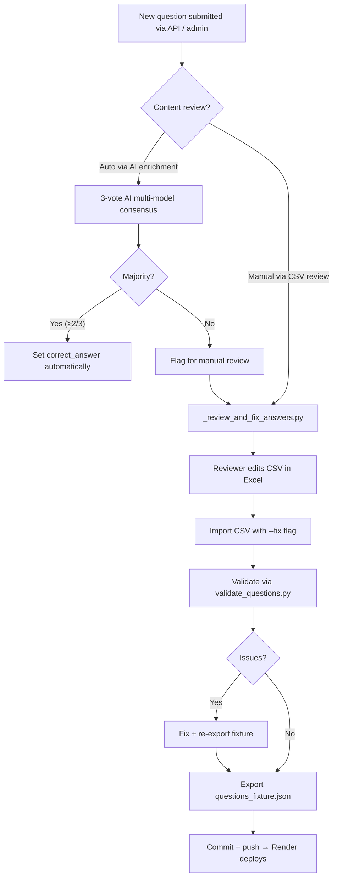
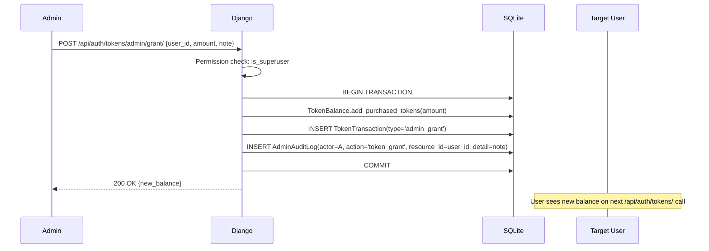

# Admin System

> Admin dashboard, permissions, admin APIs, moderation flow, and management features.

---

## 1. Admin Surfaces

CrackCMS exposes **three parallel admin surfaces**:

| Surface | Audience | URL | Auth |
|---|---|---|---|
| **Django Admin** | Superusers | `/admin/` | `is_staff=True` |
| **In-app admin page** | Admins & superusers | `/admin` (Next.js) | `role='admin' or is_superuser` |
| **REST admin APIs** | Scripts + admin SPA | `/api/auth/admin/*`, `/api/analytics/admin/*` | `is_superuser` (most endpoints) |

The Next.js `/admin` page consumes the REST admin APIs and renders user/token/payment tables. Django Admin is the canonical place for content moderation (questions, subjects, topics, flashcards).

---

## 2. Permission Model

```
Superuser (is_superuser=True)
  ├── Django Admin: all models, all actions
  ├── REST admin: every endpoint
  ├── All admin token operations
  ├── All system reset operations
  └── All user lifecycle operations

Admin (role='admin', is_staff optional)
  ├── In-app /admin page (read-only views)
  ├── Admin dashboard stats
  ├── Read AdminAuditLog (own actions)
  ├── Run RAG knowledge scan
  └── Send campaigns

Staff (is_staff=True)
  └── Django Admin (limited to models with `has_module_permission`)

User (role='student')
  └── No admin access
```

**Key distinction**: Django admin allows **Django-permission-based** granularity (per-model add/change/delete), while REST admin uses a coarser `is_superuser` check.

---

## 3. Admin REST API Map

All endpoints under `/api/auth/` and `/api/analytics/admin/`. Authentication via Bearer token + `is_superuser` permission.

### 3.1 User Lifecycle (`/api/auth/admin/`)

| Method | Path | Body | Effect |
|---|---|---|---|
| GET | `/users/` | `?role=&is_blocked=&search=&page=` | Paginated user list |
| PATCH | `/users/<id>/block/` | `{ "blocked": true, "reason": "..." }` | Toggle `is_active=False` + log audit |
| PATCH | `/users/<id>/role/` | `{ "role": "admin" }` | Promote/demote user role |
| POST | `/users/<id>/reset-progress/` | (none) | Wipe user's `QuestionAttempt` + analytics rows |
| GET | `/users/<id>/devices/` | — | List user's `UserDevice` rows |
| PATCH | `/users/<id>/subscription/` | `{ "plan": "admin_grant" }` | Manually grant subscription |
| GET | `/payments/` | — | All `PaymentAttempt` rows |

### 3.2 Token Management (`/api/auth/tokens/admin/`)

| Method | Path | Body | Effect |
|---|---|---|---|
| GET | `/users/` | — | All users + balances |
| POST | `/grant/` | `{ "user_id", "amount", "note" }` | Adjust any user's balance; logs `AdminAuditLog` with action=`token_grant` or `token_revoke` |
| POST | `/transfer/` | `{ "from_user_id?", "to_user_id", "amount", "note" }` | Move tokens between users; logs `token_transfer` |
| GET | `/audit-logs/` | — | Paginated `AdminAuditLog` |

### 3.3 System Operations (`/api/auth/admin/system/`)

| Method | Path | Body | Effect |
|---|---|---|---|
| POST | `/reset-attempts/` | `{ "scope": "all" }` or `{ "scope": "user", "user_id": 42 }` | Bulk-reset `QuestionAttempt` rows |
| POST | `/clear-analytics/` | same shape | Wipes `UserTopicPerformance`, `DailyActivity` |
| POST | `/rerun-evaluation/` | (none) | Recompute score predictions |
| POST | `/backup-data/` | (none) | Triggers DB dump, returns download URL |
| POST | `/restore-data/` | `{ "backup_id": "..." }` | Restores from backup |

### 3.4 Analytics Admin (`/api/analytics/admin/`)

| Method | Path | Description |
|---|---|---|
| GET | `/admin-dashboard/` | Cross-user aggregate: total users, active today, total attempts, total tokens sold |
| POST | `/weak-area-control/` | `{ "topic_id": 5, "threshold": 0.6 }` — adjust weak-topic detection threshold |
| GET / POST | `/campaigns/` | List / create push/email campaigns |
| POST | `/campaigns/<id>/send-now/` | Manually trigger a campaign send |

### 3.5 AI Knowledge Admin (`/api/ai/`)

| Method | Path | Description |
|---|---|---|
| POST | `/knowledge/upload/` | Upload a single PDF/MD/TXT to RAG |
| POST | `/knowledge/scan/` | Trigger scan of `backend/Medura_Train/` |
| GET | `/knowledge/stats/` | `{ "chunks": 4972, "sources": 79 }` |

---

## 4. Audit Trail

Every sensitive admin operation writes an immutable `AdminAuditLog` row:

| Field | Purpose |
|---|---|
| `actor` | Admin who performed the action (`SET_NULL` on delete to preserve history) |
| `action` | machine-readable code (e.g. `token_grant`, `user_block`) |
| `resource_type` | what kind of object (e.g. `token_balance`, `user`) |
| `resource_id` | stringified PK |
| `detail` | human-readable description |
| `metadata` | structured JSON of extra context |
| `created_at` | timestamp |

**Actions logged**:
- `token_grant` / `token_revoke` / `token_transfer` / `token_view`
- `user_view` / `user_block` / `user_role_update` / `user_progress_reset`
- `system_attempt_reset` / `system_analytics_clear` / `system_rerun_evaluation`

---

## 5. Moderation Flow (Question Content)



See [`guides/QUESTION_MANAGEMENT.md`](./guides/QUESTION_MANAGEMENT.md) for the canonical workflow.

---

## 6. Token Grant / Revoke Lifecycle



---

## 7. Subscription Management (Admin)

Admins can:
- Manually grant a subscription without payment: `PATCH /api/auth/admin/users/<id>/subscription/` with `{ "plan": "admin_grant" }`
- View all payment history: `GET /api/auth/admin/payments/`
- Receive webhook events from Razorpay: `POST /api/auth/subscribe/webhook/` (auto-creates `Subscription`)

---

## 8. Bulk Operations

| Operation | API | Use case |
|---|---|---|
| Reset attempts globally | `POST /api/auth/admin/system/reset-attempts/ {"scope":"all"}` | New test cycle |
| Clear analytics globally | `POST /api/auth/admin/system/clear-analytics/ {"scope":"all"}` | New academic year |
| Re-run score predictions | `POST /api/auth/admin/system/rerun-evaluation/` | After model update |
| Backup data | `POST /api/auth/admin/system/backup-data/` | Pre-deploy safety |
| Restore from backup | `POST /api/auth/admin/system/restore-data/ {"backup_id":"..."}` | Disaster recovery |

All bulk operations write `AdminAuditLog` with `action`=`system_*`.

---

## 9. Django Admin Highlights

Django Admin (`/admin/`) is the canonical content-moderation surface. Most useful models:

| Model | Use |
|---|---|
| `questions.Question` | Add/edit MCQs; bulk activate/deactivate |
| `questions.Subject`, `questions.Topic` | Taxonomy curation |
| `questions.Flashcard` | Audit flashcards |
| `accounts.CustomUser` | Inspect users, role changes |
| `accounts.TokenBalance`, `accounts.TokenTransaction` | Audit token usage |
| `ai_engine.ChatSession`, `ai_engine.ChatMessage` | Inspect AI history (privacy-sensitive) |
| `textbooks.Textbook`, `textbooks.PDFUpload` | Upload new textbooks |
| `analytics.Feedback` | Triage user feedback |
| `accounts.AdminAuditLog` | Read-only audit trail |

---

## 10. Frontend Admin Page (`/admin`)

`frontend/src/app/admin/page.tsx` is a client-rendered admin SPA. It calls:

- `/api/auth/admin/users/` — user list with search/filter
- `/api/auth/tokens/admin/users/` — token balances
- `/api/auth/admin/payments/` — payment history
- `/api/auth/tokens/admin/audit-logs/` — audit timeline
- `/api/analytics/admin-dashboard/` — aggregate stats

**Tabs**: Dashboard · Users · Tokens · Payments · Audit Log · Campaigns · Knowledge Base.

---

## 11. Security Considerations

- **All admin endpoints require `is_superuser`** (or `IsAdminUser` for some read-only views).
- **Every mutation writes `AdminAuditLog`** — there is no silent admin path.
- **Superuser creation**: `python manage.py createsuperuser` (CLI only; not exposed via API).
- **No API for promoting a user to superuser** — must go through Django shell or admin.
- **Admin logout** should also clear Supabase session (`clearSupabaseLocalSession()`).
- **Backup files** should be stored encrypted at rest and rotated regularly.

---

## 12. Future Admin Improvements

- Two-person approval for high-impact ops (`token_transfer`, `system_reset_*`).
- Time-bound admin actions (e.g. block user for 24 hours).
- Bulk CSV import for questions with admin approval workflow.
- Role-based access beyond student/admin (e.g. content moderator, support).
- Admin-only analytics: cohort retention, funnel analysis.
- Audit log retention policy + S3 archival.
