# Architecture

> Complete system architecture for CrackCMS — frontend, backend, AI, auth, deployment, database, and data flow.

---

## 1. System Overview

CrackCMS is a **two-tier server-rendered SPA** with an externalized AI tier. The browser hits the Next.js frontend (Vercel), which proxies authenticated calls to the Django REST backend (Render / DigitalOcean). The backend fans out to a **round-robin AI provider pool**, a **SQLite TF-IDF RAG store**, and managed services (Supabase, Sentry, Datadog, Razorpay, Gmail SMTP).

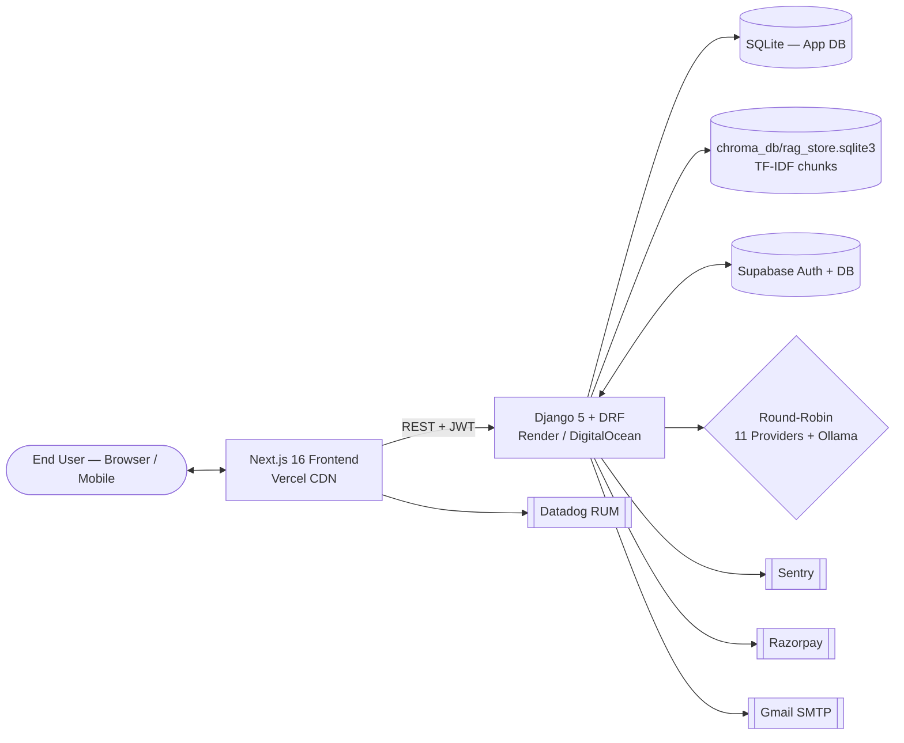

---

## 2. Frontend Architecture

The frontend is a Next.js **App Router** project (`src/app/`) with React Server + Client Components.

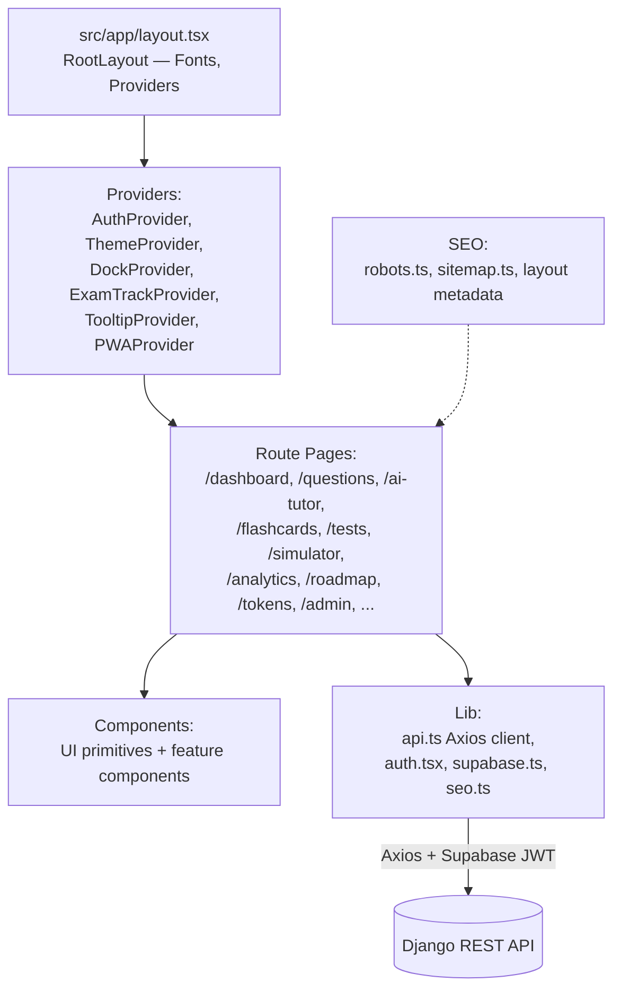

### Key Frontend Modules

| Module | Path | Responsibility |
|---|---|---|
| API Client | `frontend/src/lib/api.ts` | Axios instance, base-URL failover, Supabase JWT injection, single-device logout on `session_invalid` |
| Auth Context | `frontend/src/lib/auth.tsx` | `AuthProvider`, `useAuth` |
| Supabase Client | `frontend/src/lib/supabase.ts` | Browser-side Supabase session helpers, refresh-token error detection |
| SEO | `frontend/src/lib/seo.ts` | Brand constants, OG image defaults, metadata helpers |
| UI Primitives | `frontend/src/components/ui/*` | Radix-wrapped buttons, dialogs, dropdowns, tabs, tooltips |
| Layout | `frontend/src/app/layout.tsx` | Root providers, fonts, Datadog init, watermark, GA |

### Frontend Configuration

- `frontend/next.config.ts` — sets `outputFileTracingRoot` to repo root.
- `frontend/vercel.json` — security headers: `X-Content-Type-Options`, `X-Frame-Options`, `Referrer-Policy`, `Permissions-Policy`.
- `frontend/middleware.ts` — middleware for route protection / rewrites.
- `frontend/sentry.client.config.ts` — Sentry browser init.

---

## 3. Backend Architecture

The backend is Django 5 with a clear **app-per-bounded-context** split.

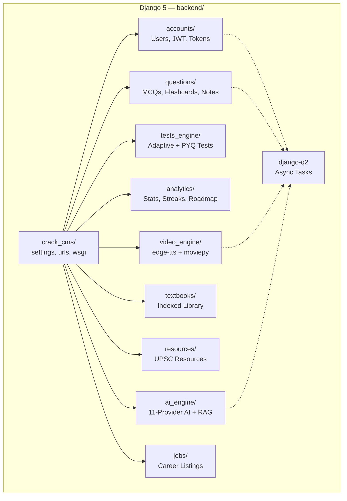

### App Responsibilities

| App | Models | Endpoints | Purpose |
|---|---|---|---|
| `accounts` | `CustomUser`, `TokenBalance`, `TokenConfig`, `TokenTransaction`, `AdminAuditLog`, `PaymentAttempt`, `Subscription`, `UserDevice` | `/api/auth/*` | Users, JWT, token wallet, devices, subscriptions, payments |
| `questions` | `ExamTrack`, `Subject`, `Topic`, `Question`, `QuestionImportJob`, `QuestionBookmark`, `QuestionFeedback`, `Discussion`, `Note`, `Flashcard`, `QuestionAttempt`, `Announcement` | `/api/questions/*` | MCQ bank, flashcards (SM-2), notes, discussions, bookmarks, chat assistant |
| `tests_engine` | `Test`, `TestAttempt`, `QuestionResponse` | `/api/tests/*` | Adaptive tests, PYQ simulator, attempt submission/review |
| `analytics` | `UserTopicPerformance`, `DailyActivity`, `Feedback`, `Announcement`, `StudyStreak`, `Badge`, `UserBadge` | `/api/analytics/*` | Dashboard, weak-topic detection, streaks, badges, leaderboard, campaigns |
| `ai_engine` | `ChatSession`, `ChatMessage`, `AIFeedback` | `/api/ai/*` | AI tutor, RAG, knowledge ingestion, study plan, high-yield topics |
| `textbooks` | textbook + upload models | `/api/textbooks/books/`, `/uploads/` | Textbook library + PDF uploads |
| `resources` | — | `/api/resources/catalog/`, `/download/<id>/`, `/exam-guide/` | UPSC resource catalog + exam guide |
| `video_engine` | — | (app skeleton) | Video generation pipeline |
| `jobs` | `JobCategory`, `Job`, `JobBookmark` | `/api/jobs/*` | Career / job listings |

### Middleware Stack (verified from `crack_cms/settings.py` lines 100–113)

Order (top → bottom):

1. `SecurityMiddleware`
2. `WhiteNoiseMiddleware` (serves static files)
3. `corsheaders.middleware.CorsMiddleware`
4. `SessionMiddleware`
5. `CommonMiddleware`
6. `CsrfViewMiddleware`
7. `AuthenticationMiddleware`
8. `MessageMiddleware`
9. `XFrameOptionsMiddleware` (deny)
10. `axes.middleware.AxesMiddleware` (brute-force)
11. **`questions.middleware.RateLimitMiddleware`** (questions-app rate limiting)
12. **`crack_cms.cache_middleware.DisableApiCacheMiddleware`** (disables client-side caching on API responses)
13. **`accounts.middleware.UpdateLastSeenMiddleware`** (updates `CustomUser.last_seen`)

---

## 4. AI Architecture

### 4.1 Round-Robin Orchestrator

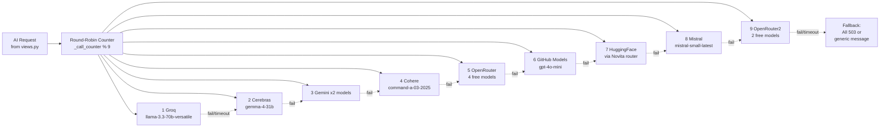

**Verified from `backend/ai_engine/services.py`**:
- `_call_ai()` rotation list has **9 entries** (verified at lines 686–694)
- **Per-request deadline 120 s** (line 701)
- **Per-provider timeout 15–20 s** (each `_call_*` method uses ThreadPoolExecutor with `result(timeout=15)`)
- **`NVIDIA Mistral` and `DeepSeek` clients are initialized but NOT in the runtime rotation** (only direct-call via `ai.nvidia_mistral` would reach them)
- `_PROVIDER_ERROR_PHRASES` filter prevents provider-internal error strings from reaching users
- Per-provider self-disable: if a provider returns 401/403, `self.<provider> = None` to skip it for the rest of the session
- **RAG is disabled when `settings.DEBUG=False`** (production) — line 282 `if not getattr(settings, 'DEBUG', False): return None`

### 4.2 RAG Pipeline

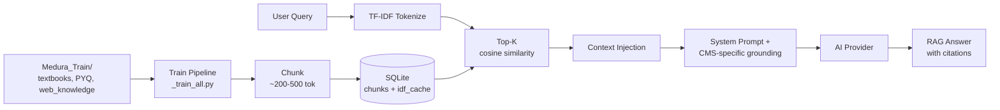

**Implementation**: `backend/ai_engine/rag_pipeline.py` + `backend/ai_engine/sqlite_rag.py`. Set `DISABLE_RAG=1` to skip on memory-constrained hosts. PDFs >50 MB auto-skipped — use `.md` summaries.

### 4.3 AI Endpoints (`/api/ai/`)

| Method | Path | Purpose |
|---|---|---|
| POST | `/tutor/` | RAG-enhanced chat tutoring |
| POST | `/explain/` | Concept explainer at adjustable depth |
| POST | `/mnemonic/` | Generate mnemonic for a topic |
| POST | `/analyze/` | Analyze a question's structure |
| POST | `/explain-answer/` | Explain after user answers (rich JSON) |
| POST | `/rag-search/` | RAG top-K chunks (no LLM) |
| POST | `/rag-answer/` | RAG-grounded answer with citations |
| POST | `/textbook-reference/` | Get textbook reference for a question |
| GET | `/screenshot/<question_id>/` | Page screenshot of textbook |
| POST | `/study-plan/` | Personalized study roadmap |
| GET | `/high-yield/` | High-yield topics list |
| POST | `/generate-questions/` | AI-generated MCQs |
| POST | `/knowledge/upload/` | Upload a single file |
| POST | `/knowledge/scan/` | Scan & reindex training folders |
| GET | `/knowledge/stats/` | Knowledge-base stats |
| GET | `/status/` | Per-provider health |
| GET | `/test/` | Smoke test |
| CRUD | `/chat/sessions/`, `/chat/sessions/<id>/messages/` | Chat history |
| POST | `/feedback/` | Submit AI feedback (+2 tokens reward on verify) |

---

## 5. Authentication Flow

CrackCMS uses a **hybrid Supabase-first / Django-JWT-fallback** auth model. The frontend attaches a Supabase access token when Supabase is configured; otherwise it falls back to Django SimpleJWT.

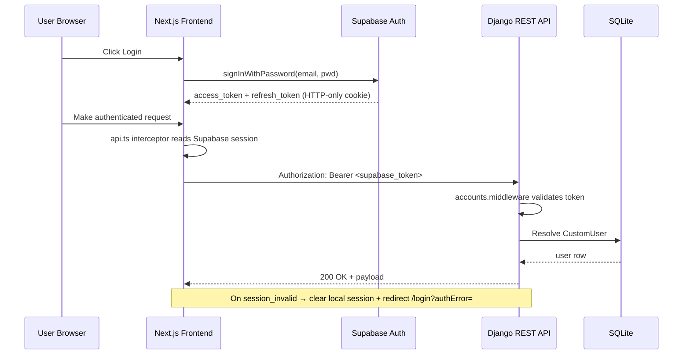

See [`AUTHENTICATION.md`](./AUTHENTICATION.md) for the full auth spec (JWT, refresh, roles, protected routes).

---

## 6. Authorization Flow

Three role tiers:

| Role | Privileges |
|---|---|
| **Anonymous** | Public landing, register/login pages |
| **Student (default)** | Question bank, AI tutor, flashcards, tests, analytics — all token-metered |
| **Staff / Superuser** | Django admin, admin token grant/transfer, system reset, weak-area control, campaigns, backups |

**Enforcement points**:
- DRF permissions (`accounts/permissions.py`, per-view `IsAdminUser` / `IsAuthenticated`).
- Django Admin (`/admin/`) requires `is_staff`.
- Admin token endpoints (`/api/auth/tokens/admin/*`) require `is_superuser`.
- Token-metered AI features check balance in middleware/service layer before provider call.

See [`ADMIN_SYSTEM.md`](./ADMIN_SYSTEM.md) for the admin permission matrix.

---

## 7. Deployment Architecture

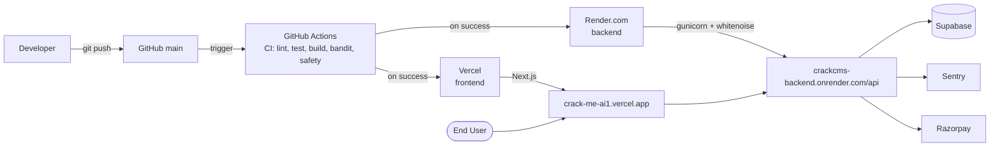

### Backend Deploy (Render)

- **Build**: `backend/build.sh` runs `pip install → collectstatic → migrate → import_neet_pg`
- **Start**: `gunicorn crack_cms.wsgi:application --workers 1 --threads 4 --timeout 180`
- **Config**: `render.yaml` (env vars referenced by `crack_cms/settings.py`)
- **Required env**: `DJANGO_SECRET_KEY`, all AI keys, `CORS_ALLOWED_ORIGINS=https://crack-me-ai1.vercel.app`, `CSRF_TRUSTED_ORIGINS=…`, `FRONTEND_URL`

### Frontend Deploy (Vercel)

- **Framework**: Next.js (auto-detected)
- **Config**: `frontend/vercel.json` (security headers + rewrites)
- **Required env**: `NEXT_PUBLIC_API_URL=https://crackcms-vsthc.ondigitalocean.app/api` (DigitalOcean is the default production API; Render is flagged unhealthy in `api.ts`), Supabase keys

### CI Pipeline (`.github/workflows/ci.yml`)

Runs on push to `main`/`develop` and PRs to `main`:

1. **Backend** (Python 3.12): `pip install` → `manage.py check --deploy` → `makemigrations --check` → `manage.py test --verbosity=2`
2. **Frontend** (Node 20): `npm ci` → `npm run lint` → `npm audit --audit-level=high` → `npm run build`
3. **Security**: `bandit -r backend/` + `safety check -r backend/requirements.txt`

### Pre-commit Hook (`.pre-commit-config.yaml`)

- Local `secret-scan` hook → `python scripts/scan_secrets.py`

---

## 8. Database Architecture

### Primary DB — `backend/db.sqlite3` (committed via Git LFS)

Django app tables (see [`DATA_MODEL.md`](./DATA_MODEL.md) for every model + FK + index):

| App | Core Tables |
|---|---|
| `accounts` | `accounts_customuser`, `accounts_tokenbalance`, `accounts_tokenconfig`, `accounts_tokentransaction`, `accounts_adminauditlog`, `accounts_paymentattempt`, `accounts_subscription`, `accounts_userdevice` |
| `questions` | `questions_examtrack`, `questions_subject`, `questions_topic`, `questions_question`, `questions_questionimportjob`, `questions_questionbookmark`, `questions_questionfeedback`, `questions_discussion`, `questions_discussionvote`, `questions_note`, `questions_flashcard`, `questions_questionattempt`, `questions_announcement` |
| `tests_engine` | `tests_test`, `tests_testattempt`, `tests_questionresponse` |
| `analytics` | `analytics_usertopicperformance`, `analytics_dailyactivity`, `analytics_feedback`, `analytics_announcement`, `analytics_studystreak`, `analytics_badge`, `analytics_userbadge` |
| `ai_engine` | `ai_engine_chatsession`, `ai_engine_chatmessage`, `ai_engine_aifeedback` |
| `textbooks` | textbook + upload tables |
| `jobs` | `jobs_jobcategory`, `jobs_job`, `jobs_jobbookmark` |
| `django_q` | Task queue tables (managed by `django-q2`) |
| `axes` | Login-attempt tracking |

### RAG DB — `backend/chroma_db/rag_store.sqlite3` (committed via Git LFS)

```sql
CREATE TABLE IF NOT EXISTS chunks (
    id TEXT PRIMARY KEY,
    document TEXT NOT NULL,
    book TEXT NOT NULL,
    page INTEGER DEFAULT 0,
    chunk_index INTEGER DEFAULT 0,
    source_file TEXT DEFAULT '',
    tokens TEXT DEFAULT ''
);
CREATE TABLE IF NOT EXISTS idf_cache (
    term TEXT PRIMARY KEY,
    idf REAL NOT NULL
);
CREATE INDEX IF NOT EXISTS idx_chunks_book ON chunks(book);
```

### Production DB Strategy

- **SQLite is the default** for development and small production.
- `dj_database_url` is included — set `DATABASE_URL=postgres://…` in Render env to switch to Postgres.
- The committed `db.sqlite3` keeps a working seed that Render can use at boot.
- See [`setup/SUPABASE_SETUP.md`](./setup/SUPABASE_SETUP.md) for migration steps.

### Backup Strategy

- Fixture file `backend/questions_fixture.json` is the canonical question-bank snapshot.
- `data_dump*.json` + `data_versions/` retain periodic dumps.
- Admin endpoint `/api/auth/admin/system/backup-data/` and `/restore-data/` provide runtime backup/restore.

---

## 9. Request Lifecycle

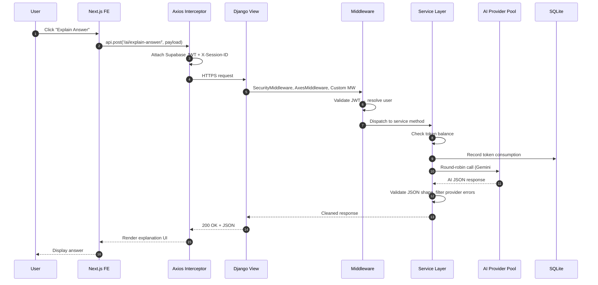

---

## 10. Data Flow

### Question Bank Flow

```mermaid
flowchart LR
    PDF[PDF / MD / TXT] --> Extract[PYQ Extractor\n+ Document Processor]
    Extract --> Raw[Raw Question Records]
    Raw --> Enrich[AI Enrichment]
    Enrich --> Vetted[Multi-Model Vote]
    Vetted --> DB[(questions DB)]
    DB --> Validate[validate_questions.py]
    Validate --> Export[_export_fixture.py]
    Export --> Fixture[questions_fixture.json]
    Fixture --> Deploy[build.sh on Render]
    Deploy --> LiveDB[(Production SQLite)]
    LiveDB --> API[/api/questions/*/]
    API --> FE[Next.js UI]
```

### RAG Ingestion Flow

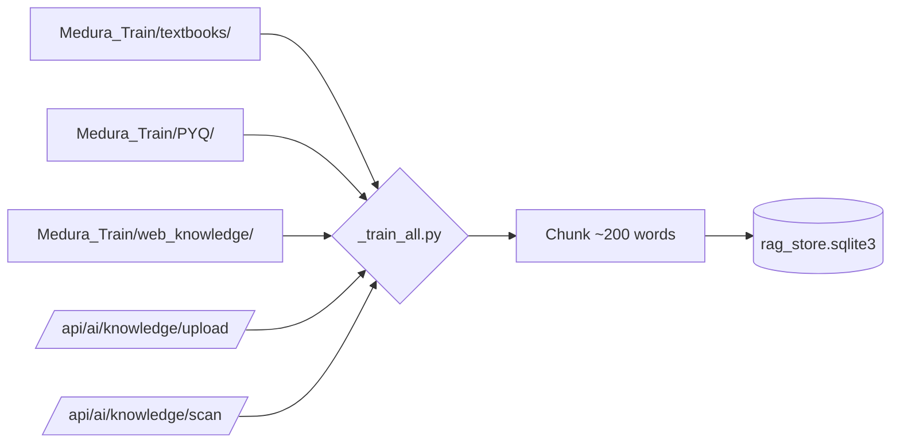

### Token Consumption Flow

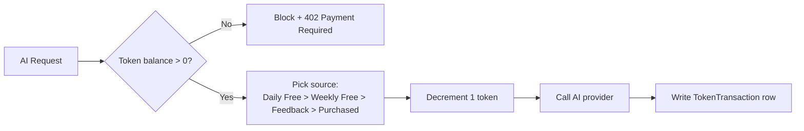

---

## 11. Error Handling Flow

### Frontend

- `api.ts` response interceptor:
  - On `code: 'session_invalid'` → clear Supabase local session + redirect to `/login?authError=…`.
  - On 502/503/504 → automatic base-URL failover (production fallback URL).
  - Other errors → `Promise.reject` to caller.

### Backend

- `django-axes` lockout after 5 failed attempts.
- DRF exception handler returns structured `{ "error": "...", "code": "..." }`.
- Sentry captures unhandled exceptions (gated by `SENTRY_DSN` env var).
- `_PROVIDER_ERROR_PHRASES` filter prevents AI provider error strings from reaching users.
- 120 s request deadline; per-provider 15–20 s timeout.
- All admin token grants/transfers write `AdminAuditLog` rows.

### Logging

- Structured logs via `python-json-logger`.
- `ddtrace` for distributed tracing.
- `frontend/sentry.client.config.ts` for browser errors.
- Datadog RUM + browser logs via `DatadogInit` component.

---

## 12. Environment Configuration

### Backend `.env` (see `backend/.env.example`)

| Variable | Required | Notes |
|---|---|---|
| `DJANGO_SECRET_KEY` | Yes (prod) | Falls back to insecure default in DEBUG |
| `DEBUG` | No | `True`/`False` |
| `ALLOWED_HOSTS` | Yes (prod) | Comma-separated |
| `DATABASE_URL` | No | Postgres override of SQLite |
| `GROQ_API_KEY` … `DEEPSEEK_API_KEY` | No (graceful skip) | All 11 AI providers |
| `CORS_ALLOWED_ORIGINS` | Yes (prod) | `https://crack-me-ai1.vercel.app` |
| `CSRF_TRUSTED_ORIGINS` | Yes (prod) | `https://crack-me-ai1.vercel.app` |
| `EMAIL_HOST_USER` / `EMAIL_HOST_PASSWORD` | Yes (prod) | Gmail App Password |
| `FRONTEND_URL` | Yes (prod) | Used in password-reset emails |
| `SENTRY_DSN` | No | Enables Sentry init |
| `DISABLE_RAG` | No | Set to `1` to skip RAG init |
| `OLLAMA_MODEL` | No | Default `llama3.2:3b` |

### Frontend `.env.local`

| Variable | Required | Notes |
|---|---|---|
| `NEXT_PUBLIC_API_URL` | Yes | Production: DigitalOcean URL |
| `NEXT_PUBLIC_API_FALLBACK_URL` | No | Failover URL |
| `NEXT_PUBLIC_USE_API_PROXY` | No | Local dev only |
| `NEXT_PUBLIC_SUPABASE_URL` | Conditional | When Supabase auth enabled |
| `NEXT_PUBLIC_SUPABASE_ANON_KEY` | Conditional | |
| `NEXT_PUBLIC_GA_MEASUREMENT_ID` | No | Default: `G-MM88RT1QQK` |
| `NEXT_PUBLIC_ANALYTICS_IN_DEV` | No | Enable GA in dev |

---

## 13. Architectural Decisions & Rationale

| Decision | Rationale |
|---|---|
| **SQLite default** | Zero infra cost at low traffic; `dj_database_url` allows painless Postgres upgrade |
| **11-provider AI pool** | No single-vendor dependency; combined free tier ~35K req/day |
| **Ollama fallback** | Guarantees platform availability even with zero internet |
| **TF-IDF over vector embeddings** | No extra runtime cost, no model downloads |
| **Fixture-first question workflow** | Reproducible deploys; PRs reviewed as JSON diffs |
| **Token economy** | Aligns free-tier users with growth loop; pays for AI cost |
| **Hybrid Supabase + Django JWT** | Modern Supabase auth UX + battle-tested Django permissions |
| **Single-device session enforcement** | Anti-account-sharing for paid content |
| **Git LFS for PDFs + sqlite** | Avoids bloating git history with binary content |
| **App-per-bounded-context** | Easy to spin out into microservices later if scale demands |
