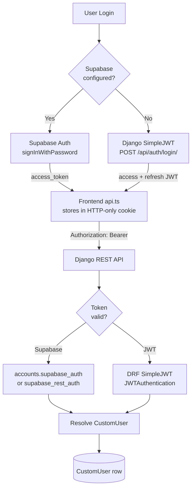
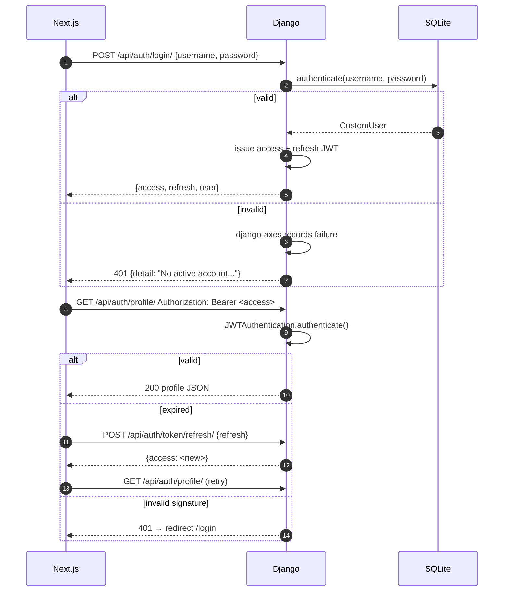
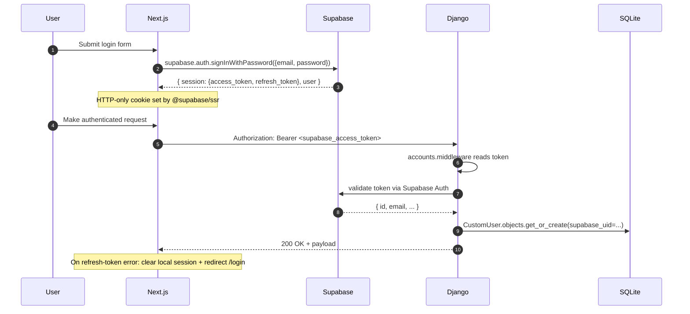
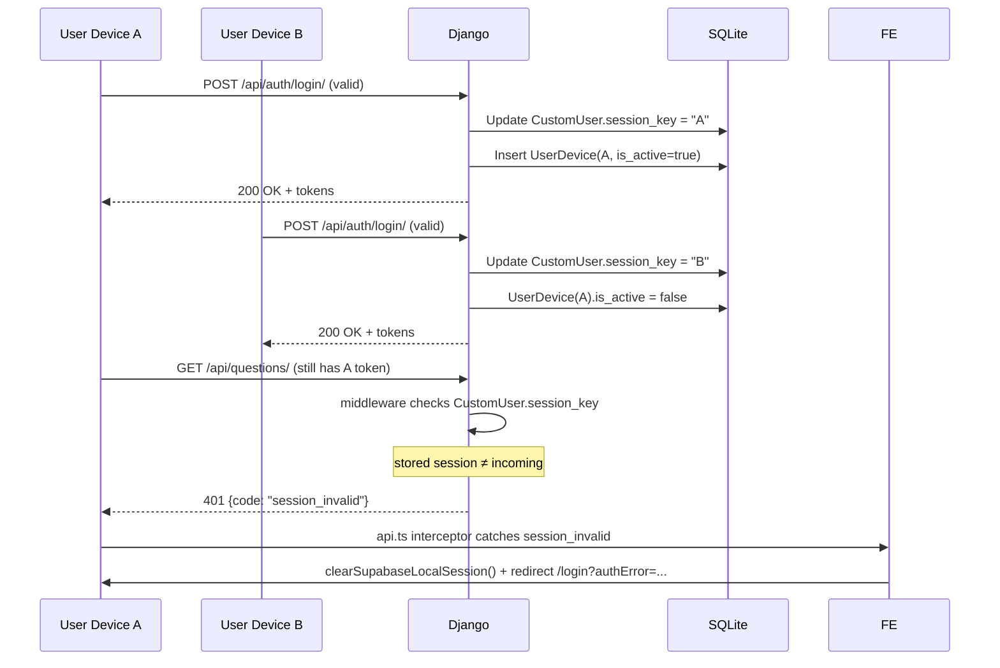
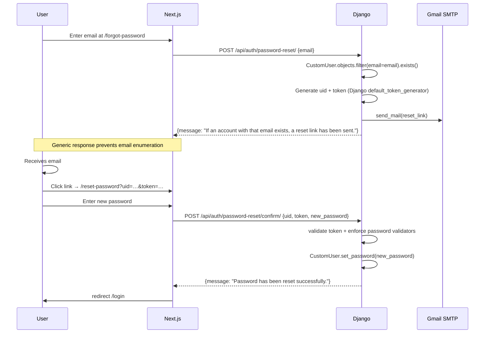
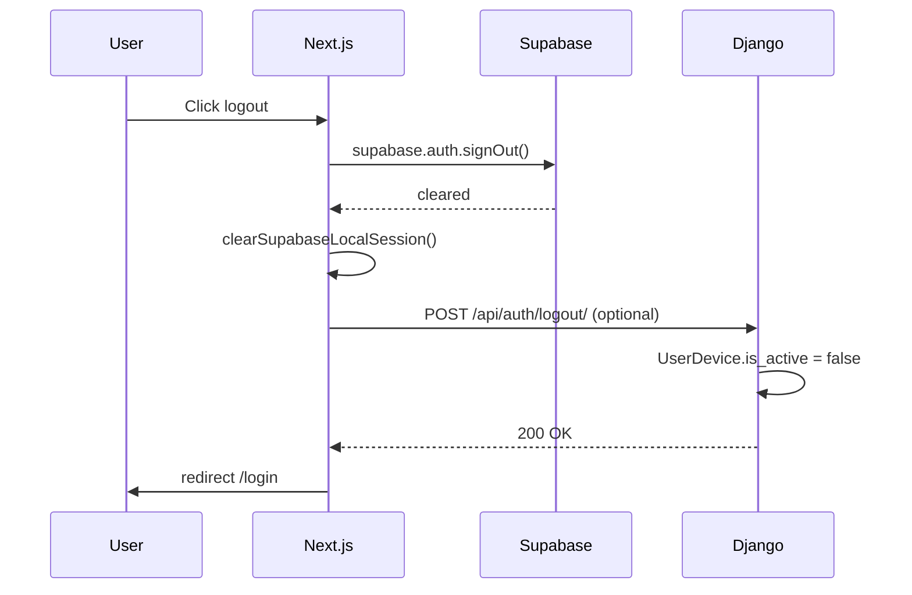

# Authentication & Authorization

> JWT / session flow, token refresh, role permissions, authorization model, security model, and protected routes.

---

## 1. Two-Layer Auth Model

CrackCMS uses a **hybrid Supabase-first / Django-JWT-fallback** model:



---

## 2. Token Types

| Token | Source | TTL | Storage |
|---|---|---|---|
| **Supabase access token** | `signInWithPassword` | 1 hour (Supabase default) | HTTP-only cookie via `@supabase/ssr` |
| **Supabase refresh token** | `signInWithPassword` | 7 days (Supabase default) | HTTP-only cookie |
| **Django access JWT** | `/api/auth/login/` | 1 day (`SIMPLE_JWT` config) | localStorage (legacy path) |
| **Django refresh JWT** | `/api/auth/login/` | 7 days | localStorage |
| **Session device ID** | `frontend/src/lib/api.ts` | Persistent per browser | localStorage `crack_device_id` |
| **Password-reset token** | `/api/auth/password-reset/` | 24 hours (Django default) | URL param `?uid=…&token=…` |
| **Ollama bearer** | n/a | n/a | none (local only) |

---

## 3. JWT Flow (Django SimpleJWT path)



**Settings** (`SIMPLE_JWT` in `crack_cms/settings.py`):
- `ACCESS_TOKEN_LIFETIME = timedelta(days=1)`
- `REFRESH_TOKEN_LIFETIME = timedelta(days=7)`
- `ROTATE_REFRESH_TOKENS = False`
- `BLACKLIST_AFTER_ROTATION = False`
- `ALGORITHM = "HS256"`

---

## 4. Supabase Flow (preferred path)



**Why Supabase-first**:
- Modern auth UX (passwordless, OAuth, MFA)
- Hosted Postgres backup option
- Reduced Django auth code surface

**Fallback** (no Supabase env vars): `frontend/src/lib/supabase.ts::isSupabaseAuthEnabled()` returns false → `api.ts` skips Supabase JWT injection → user must use Django JWT.

---

## 5. Token Refresh Strategy

### Frontend (`api.ts`)

The Axios response interceptor does **not** auto-refresh on 401 today — it relies on Supabase's automatic refresh-on-401. Django JWT manual refresh requires an explicit endpoint:

```
POST /api/auth/token/refresh/
Body: { "refresh": "<jwt_refresh>" }
Response: { "access": "<new_access>" }
```

When Supabase is enabled, its client handles refresh internally. When using Django JWT, the frontend must catch 401 and call `/token/refresh/` itself.

---

## 6. Single-Device Session Enforcement



**Mechanism**: `accounts/middleware.py` compares `request.user.session_key` (or current_session_id) with the device's stored session.

---

## 7. Roles & Permissions

### Role hierarchy

```
Anonymous
  └── Authenticated (any CustomUser)
        └── Student (role='student')
              └── Admin (role='admin')          # additional privileges
                    └── Superuser (is_superuser) # Django admin + every endpoint
```

### Permission matrix

| Capability | Anonymous | Student | Admin | Superuser |
|---|---|---|---|---|
| View landing, register, login | ✓ | ✓ | ✓ | ✓ |
| Use question bank | ✓ (limited) | ✓ | ✓ | ✓ |
| Use AI tutor / explain | — | ✓ (token-metered) | ✓ (bypassed) | ✓ (bypassed) |
| Purchase tokens / subscribe | — | ✓ | ✓ | ✓ |
| Create bookmark / flashcard / note | — | ✓ (own) | ✓ | ✓ |
| Submit feedback | — | ✓ | ✓ | ✓ |
| Receive feedback reward (+2 tokens) | — | ✓ | ✓ | ✓ |
| Django admin (`/admin/`) | — | — | partial | ✓ |
| Admin token grant/transfer | — | — | — | ✓ |
| Admin user block / role change | — | — | — | ✓ |
| System reset attempts / analytics | — | — | — | ✓ |
| Backup / restore data | — | — | — | ✓ |
| Run RAG knowledge scan | — | — | ✓ | ✓ |
| Send campaigns | — | — | ✓ | ✓ |
| Read audit log | — | — | ✓ (own actions) | ✓ (all) |
| Adjust weak-topic thresholds | — | — | — | ✓ |

### Enforcement

| Layer | Implementation |
|---|---|
| View-level | DRF `permission_classes = [IsAuthenticated]`, `IsAdminUser` |
| Object-level | DRF `get_queryset()` filters by `request.user` |
| URL-level | `accounts/permissions.py` custom classes |
| Middleware | `django-axes` brute-force lockout |
| Frontend | `useAuth()` hook reads `AuthProvider`; `api.ts` attaches token |

---

## 8. Protected Routes (Frontend)

| Route | Auth required | Role |
|---|---|---|
| `/`, `/login`, `/register`, `/forgot-password`, `/reset-password` | No | — |
| `/dashboard` | Yes | Any |
| `/questions` | Yes (read preview OK) | Any |
| `/ai-tutor`, `/generate`, `/roadmap` | Yes | Any |
| `/flashcards`, `/tests`, `/simulator`, `/bookmarks`, `/analytics`, `/trends` | Yes | Any |
| `/tokens`, `/subscription` | Yes | Any |
| `/settings` | Yes | Any |
| `/leaderboard`, `/jobs`, `/feedback`, `/contact` | Yes | Any |
| `/textbooks`, `/resources`, `/upload` | Yes | Any |
| `/admin` | Yes | Admin |

The frontend `middleware.ts` performs redirects to `/login` for unauthenticated access to protected paths.

---

## 9. Security Model

### Defense layers (outermost first)

1. **TLS** (Vercel + Render terminate HTTPS; production: HSTS 1 year, include subdomains, preload, SSL redirect).
2. **CORS**: `CORS_ALLOWED_ORIGINS` restricted to `https://crack-me-ai1.vercel.app` (prod). Custom headers: `x-session-id` added to defaults.
3. **Security headers** (`vercel.json` + Django): `X-Content-Type-Options`, `X-Frame-Options=DENY`, `Referrer-Policy=strict-origin-when-cross-origin`, `Permissions-Policy`, `SECURE_BROWSER_XSS_FILTER=True`.
4. **CSRF**: Django CSRF middleware on session endpoints; JWT/Supabase endpoints use Bearer auth (CSRF-immune). `CSRF_COOKIE_HTTPONLY=True`, `CSRF_TRUSTED_ORIGINS` configured.
5. **Authentication**: `accounts.supabase_rest_auth.SupabaseJWTAuthentication` (primary) + `SessionAuthentication` fallback.
6. **Authorization**: per-view DRF permission classes (`IsAuthenticated`, `IsAdminUser`, `IsControlTowerAdmin`).
7. **Brute-force**: `django-axes` — 5 failed attempts → 30 min lockout per `[username, ip_address]`. Resets on success.
8. **Single-device**: `CustomUser.session_key` + `UserDevice` enforcement (returns `code: 'session_invalid'` to old devices).
9. **Rate limiting** (verified from `settings.py`):
   - DRF: `AnonRateThrottle` 120/min, `UserRateThrottle` 600/min, `ScopedRateThrottle admin_control_tower` 180/min
   - Custom: `questions.middleware.RateLimitMiddleware` — 60 GET/min/IP on `/api/questions/`
   - AI provider-level: Groq 30 RPM, Gemini 15 RPM, etc. + Ollama local fallback
10. **AI error filtering**: `_PROVIDER_ERROR_PHRASES` prevents provider-internal error text from reaching users.
11. **Sentry**: unhandled exception capture (when `SENTRY_DSN` set).
12. **Audit trail**: `AdminAuditLog` append-only.
13. **Database startup guards**: production refuses to run without `DATABASE_URL`; SQLite LFS pointer detection.

### Threat model summary

| Threat | Mitigation |
|---|---|
| Credential stuffing | `django-axes` lockout |
| Token theft | HTTP-only cookies (Supabase path); short TTL (1 day JWT) |
| Account sharing | Single-device enforcement |
| Privilege escalation | DRF permission classes + `is_staff` checks |
| CSRF | Bearer auth on write endpoints; CSRF on Django session endpoints |
| Open redirect | Only `FRONTEND_URL` is used for email links |
| AI provider error leakage | `_PROVIDER_ERROR_PHRASES` filter |
| Mass token drain | Rate limits + token balance check + provider rotation |
| SQL injection | Django ORM parameterized queries |
| XSS | React auto-escapes by default; no `dangerouslySetInnerHTML` in user content paths |
| Secret leak | `.gitignore` excludes `.env`; pre-commit `secret-scan` hook |

---

## 10. Session Lifecycle

```
┌─────────────────┐
│  Anonymous       │
└────────┬────────┘
         │ register / login
         ▼
┌─────────────────┐
│  Authenticated   │   ← CustomUser created, TokenBalance seeded
└────────┬────────┘
         │ session_key set, UserDevice created
         ▼
┌─────────────────┐
│  Active session  │   ← X-Session-ID + Bearer token
└────────┬────────┘
         │ logout / expire / 401
         ▼
┌─────────────────┐
│  Anonymous       │
└─────────────────┘
```

### Token TTLs & reset policies

| Token | Reset trigger | Reset value |
|---|---|---|
| Daily free tokens | Midnight local | `daily_tokens_used = 0` |
| Weekly free tokens | Monday 00:00 local | `weekly_tokens_used = 0` |
| Purchased tokens | Never | n/a |
| Feedback credits | Never | n/a |
| Django access JWT | 1 day | Re-login |
| Django refresh JWT | 7 days | Re-login |
| Supabase access | 1 hour | Auto-refresh |
| Supabase refresh | 7 days | Re-login |
| Password reset token | 24 hours | Request new |
| Single-device session | On new login | Old device invalidated |

---

## 11. Frontend Auth Wiring

### `lib/auth.tsx` (`AuthProvider`)
- Reads Supabase session on mount
- Exposes `useAuth()` hook with `{ user, isAdmin, isAuthenticated, login, logout, refresh }`

### `lib/supabase.ts`
- `getSupabaseBrowserClient()` — lazily constructs the browser client
- `isSupabaseAuthEnabled()` — checks env vars (`NEXT_PUBLIC_SUPABASE_URL`, `NEXT_PUBLIC_SUPABASE_ANON_KEY`)
- `isInvalidRefreshTokenError()` — detects refresh-token rotation failures
- `clearSupabaseLocalSession()` — clears cookies + storage

### `lib/api.ts` request interceptor
```typescript
api.interceptors.request.use(async (config) => {
  config.headers['X-Session-ID'] = getOrCreateSessionId();
  if (isSupabaseAuthEnabled()) {
    const { data } = await getSupabaseBrowserClient().auth.getSession();
    config.headers.Authorization = `Bearer ${data.session?.access_token}`;
  }
  return config;
});
```

### `lib/api.ts` response interceptor
```typescript
api.interceptors.response.use(
  (r) => r,
  async (error) => {
    if (error.response?.data?.code === 'session_invalid') {
      await clearSupabaseLocalSession();
      window.location.href = '/login?authError=ur%20logged%20in%20another%20device';
      return new Promise(() => {}); // halt
    }
    // 502/503/504 → failover to FALLBACK_API_BASE_URL
    if ([502,503,504].includes(error.response?.status)) {
      error.config._apiBaseFailover = true;
      error.config.baseURL = FALLBACK_API_BASE_URL;
      return api(error.config);
    }
    return Promise.reject(error);
  }
);
```

---

## 12. Backend Auth Wiring

### `accounts/middleware.py`
- Reads `Authorization: Bearer …` header
- For Supabase tokens: calls `supabase_auth.validate_token()` → resolves `CustomUser`
- For JWT: delegates to DRF `JWTAuthentication`
- Compares `request.user.session_key` with the active device's session ID → emits `session_invalid` if mismatched
- Attaches `request.user`, `request.user_role`, `request.is_admin`

### `accounts/permissions.py`
- `IsAdmin` — DRF permission class requiring `role='admin' or is_superuser`
- `IsSuperUser` — requires `is_superuser`
- `IsTokenHolder` — requires positive token balance (for AI endpoints)

### `accounts/supabase_auth.py` & `supabase_rest_auth.py`
- `validate_token(token)` → calls Supabase REST `/auth/v1/user` with the token to validate signature + expiry
- `resolve_user(supabase_uid, email)` → returns or creates `CustomUser`

---

## 13. Password Reset Flow



**Email backend selection** (`crack_cms/settings.py`):
```python
if EMAIL_HOST_PASSWORD and EMAIL_HOST_PASSWORD.strip():
    EMAIL_BACKEND = 'django.core.mail.backends.smtp.EmailBackend'
else:
    EMAIL_BACKEND = 'django.core.mail.backends.console.EmailBackend'
```

See [`setup/EMAIL_SETUP.md`](./setup/EMAIL_SETUP.md) for Gmail App Password configuration.

---

## 14. Logout



(Note: explicit Django logout endpoint may not be implemented; Supabase sign-out + `clearSupabaseLocalSession()` is the primary path.)
