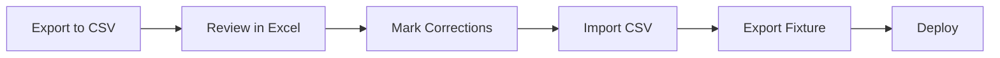

# Question Management Guide

> Canonical guide for managing UPSC CMS questions across **all 5 methods**:
> Django Admin · Django Shell · REST API · Fixture File · CSV Review.

Consolidates the former `QUESTION_MANAGEMENT_GUIDE.md`, `QUESTION_MANUAL_UPDATE_GUIDE.md`, and `DATA_PIPELINE.md`.

---

## Source of Truth

- **`backend/questions_fixture.json`** is the production seed, loaded by `backend/build.sh` during deploy.
- **DB edits → `_export_fixture.py`** → commit JSON → push.
- If you edit `questions_fixture.json` directly, validate and `loaddata` before committing.

---

## Quick Decision Table

| Scenario | Best method |
|---|---|
| Edit 1 question via GUI | Django Admin |
| Edit 1 question via code | Django Shell |
| Bulk import (programmatic) | REST API (`POST /api/questions/upload/`) |
| Bulk edit (offline) | Fixture File |
| Bulk review (correctness) | CSV Review (`_review_and_fix_answers.py`) |

---

## Method 1 — Django Admin (Recommended for 1–5 questions)

1. Start backend: `cd backend && python manage.py runserver`
2. Open `http://localhost:8000/admin/`
3. Login as superuser (create with `python manage.py createsuperuser` if needed)
4. Go to **Questions** → **Questions**
5. Click **Add Question** or open an existing one

### Required fields

- `question_text` — the MCQ
- `option_a`, `option_b`, `option_c`, `option_d`
- `correct_answer` — `A` / `B` / `C` / `D`
- `year` — PYQ year (e.g. `2022`)
- `subject` — FK dropdown

### Recommended fields

- `topic` — FK to Topic
- `difficulty` — `easy` / `medium` / `hard`
- `explanation` — 3–4 sentences
- `mnemonic` — memory aid
- `concept_tags` — JSON array
- `textbook_reference` — `"Harrison's Ch. 121"`

### Bulk admin actions

- **Activate / Deactivate selected questions**
- **Check questions without explanations** (audit)

### After admin edits

```bash
cd backend
python _export_fixture.py
git add questions_fixture.json
git commit -m "fix: correct answers for Q#35, Q#42"
git push
```

---

## Method 2 — Django Shell (Quick fixes)

```bash
cd backend
python manage.py shell
```

### Update one question

```python
from questions.models import Question
q = Question.objects.get(id=42)
q.correct_answer = 'B'
q.explanation = 'Streptococcus pneumoniae is the most common cause of CAP. Ref: Harrison Ch.121'
q.mnemonic = 'Pneumonia = Pneumoniae (#1 cause)'
q.book_name = "Harrison's Principles of Internal Medicine"
q.chapter = 'Pneumonia'
q.difficulty = 'medium'
q.concept_tags = ['Pulmonology', 'Infectious Disease', 'CAP']
q.save()
```

### Bulk update by ID

```python
fixes = {42: 'B', 105: 'C', 237: 'A'}
for pk, ans in fixes.items():
    Question.objects.filter(pk=pk).update(correct_answer=ans)
```

### Bulk update by filter

```python
Question.objects.filter(year=2019, subject__code='PSM').update(difficulty='medium')
```

### Find questions missing explanations

```python
no_expl = Question.objects.filter(explanation='')
print(f'{no_expl.count()} questions have no explanation')
for q in no_expl[:20]:
    print(f'  ID={q.id} Year={q.year} {q.question_text[:80]}')
```

---

## Method 3 — REST API (Programmatic)

### Login + get admin JWT

```bash
curl -X POST http://127.0.0.1:8000/api/auth/login/ \
  -H "Content-Type: application/json" \
  -d '{"username": "admin", "password": "your_password"}'
# {"access": "eyJ...", "refresh": "eyJ..."}
```

### Update a question

```bash
curl -X PATCH http://127.0.0.1:8000/api/questions/42/ \
  -H "Authorization: Bearer eyJ..." \
  -H "Content-Type: application/json" \
  -d '{"correct_answer": "B", "explanation": "...", "concept_tags": ["Cardiology"]}'
```

### Bulk upload

```python
import requests

BASE = 'http://127.0.0.1:8000/api'
r = requests.post(f'{BASE}/auth/login/', json={'username': 'admin', 'password': 'your_password'})
headers = {'Authorization': f'Bearer {r.json()["access"]}'}

questions = [
    {
        "question_text": "Most common cause of CAP?",
        "option_a": "Staphylococcus aureus",
        "option_b": "Streptococcus pneumoniae",
        "option_c": "Klebsiella pneumoniae",
        "option_d": "Pseudomonas aeruginosa",
        "correct_answer": "B",
        "year": 2024,
        "subject": 1,
        "difficulty": "easy",
        "explanation": "S. pneumoniae is the #1 cause of CAP.",
    }
]

r = requests.post(f'{BASE}/questions/upload/', headers=headers, json=questions)
print(r.status_code, r.json())
```

---

## Method 4 — Fixture File (Bulk Offline)

### Fixture structure

```json
{
  "model": "questions.question",
  "pk": 42,
  "fields": {
    "question_text": "Most common cause of CAP?",
    "option_a": "Staphylococcus aureus",
    "option_b": "Streptococcus pneumoniae",
    "option_c": "Klebsiella pneumoniae",
    "option_d": "Pseudomonas aeruginosa",
    "correct_answer": "B",
    "year": 2019,
    "subject": 1,
    "topic": 5,
    "difficulty": "medium",
    "concept_tags": ["Pulmonology", "Infectious Disease"],
    "explanation": "S. pneumoniae is the most common cause...",
    "mnemonic": "Pneumonia = Pneumoniae (#1 cause)",
    "book_name": "Harrison's Principles of Internal Medicine",
    "chapter": "Pneumonia",
    "page_number": "pp. 908-920",
    "is_active": true
  }
}
```

### Edit the fixture

1. Open `backend/questions_fixture.json` in a text editor
2. Find the question (search by text or `pk`)
3. Edit fields
4. Save

### Validate

```bash
cd backend
python -m json.tool questions_fixture.json > /dev/null  # JSON valid?
python manage.py loaddata questions_fixture.json        # Loads OK?
python manage.py shell -c "from questions.models import Question; print(Question.objects.count())"
```

### Export DB → fixture (after admin/shell edits)

```bash
cd backend
python _export_fixture.py    # or:
python manage.py dumpdata questions --indent 2 -o questions_fixture.json
```

---

## Method 5 — CSV Review Workflow (Bulk Answer Correction)

Use when discovering questions with wrong `correct_answer` values (common in older PYQs 2018–2020).

### Flow



### Step 1 — Export

```bash
cd backend
python _review_and_fix_answers.py export --year 2018
```

Creates `questions_review_2018.csv` with columns:
- Question ID, Year, Subject, Topic, Question Text, Options A–D
- **Current Answer** (what's in DB)
- **Correct Answer** (empty — fill if wrong)
- Explanation, Mnemonic, Tags, Notes

### Step 2 — Review in Excel

| Question_ID | Current_Answer | Correct_Answer | Explanation | Mnemonic |
|---|---|---|---|---|
| 35 | A | C | Clonus is characteristic of UMN lesions | CLONUS: C-Clonus, L-Loss of inhibition... |

### Step 3 — Dry-run import

```bash
python _review_and_fix_answers.py import questions_review_2018.csv
```

### Step 4 — Apply corrections

```bash
python _review_and_fix_answers.py import questions_review_2018.csv --fix
```

Confirm `yes` when prompted.

### Step 5 — Export fixture

```bash
python _export_fixture.py
```

### Step 6 — Commit + deploy

```bash
git add questions_fixture.json
git commit -m "fix: correct answers for 2018 questions"
git push origin main
```

---

## Question Fields Reference

| Field | Type | Example |
|---|---|---|
| `question_text` | Text | "Which organism causes CAP?" |
| `option_a/b/c/d` | Text | "Staphylococcus aureus" |
| `correct_answer` | A/B/C/D | "B" |
| `year` | Integer | 2019 |
| `subject` | FK (ID) | 1 |
| `topic` | FK (ID) | 5 |
| `difficulty` | easy/medium/hard | "medium" |
| `explanation` | Text | "S. pneumoniae is..." |
| `concept_explanation` | Text | Underlying concept |
| `mnemonic` | Text | "MUDPILES" |
| `concept_tags` | JSON array | `["Cardiology"]` |
| `concept_keywords` | JSON array | `["pneumonia"]` |
| `book_name` | String | "Harrison's" |
| `chapter` | String | "Pneumonia" |
| `page_number` | String | "pp. 908-920" |
| `reference_text` | Text | Textbook excerpt |
| `learning_technique` | Text | "Compare CAP vs HAP" |
| `shortcut_tip` | Text | "If 'most common'..." |
| `ai_explanation` | Text | Auto-generated |
| `is_active` | Boolean | true |
| `times_asked` | Integer | 3 |

---

## AI Enrichment (Advanced)

Use **only as a draft accelerator** — all AI-generated medical content must be SME-reviewed.

```bash
cd backend
python enrich_turbo.py                    # Parallel enrichment
python _fix_and_enrich_answers.py --fix   # Fix + enrich in batch
```

Or via management command:

```bash
cd backend
python manage.py enrich_questions --mode hybrid --limit 100 --only-missing --sleep-ms 500
python _export_fixture.py
```

⚠️ **Always** `--only-missing` to avoid overwriting curated data.

### Enrichment quality

Current state (per `reference/DEPLOYMENT_CAPACITY.md`):
- ~54% missing correct answers — manual PYQ key required
- ~10% enriched with tags — rule-based + manual
- ~10% with explanations — AI-assisted + manual
- ~50% questions fully curated

---

## Validation

```bash
cd backend
python validate_questions.py
```

Checks:
- Missing answers
- Empty options
- Invalid answer letters
- Answer-option mismatch
- Fuzzy duplicates (≥85% similarity)

Output: `validation_report.json`

---

## Production Deploy Flow

`backend/build.sh` does:

1. `pip install -r requirements.txt`
2. `python manage.py collectstatic --no-input`
3. `python manage.py migrate --no-input`
4. `python manage.py import_neet_pg`
5. Fixture load (via Render env config or custom script)
6. Hard-check: question count > 0 (else fail build)

---

## Operational Checklist (Every Update Cycle)

1. ✅ Add/edit questions (Admin / API / shell / fixture / CSV)
2. ✅ Validate: `python validate_questions.py`
3. ✅ Export fixture (unless you edited fixture directly)
4. ✅ Commit code + fixture
5. ✅ Push and verify production counts: `GET /api/questions/stats/`, `GET /api/questions/years/`

---

## Useful Endpoints for Verification

- `GET /api/questions/years/` — list years with question counts
- `GET /api/questions/stats/` — overall stats
- `GET /api/questions/?year=2018` — filter by year
- `GET /api/questions/?subject=1&topic=5&difficulty=medium` — multi-filter

---

## See Also

- [`DATA_MODEL.md`](../DATA_MODEL.md) — `Question` model reference
- [`API_REFERENCE.md`](../API_REFERENCE.md) — endpoint specs
- [`FEATURES.md`](../FEATURES.md#7-question-bank) — question bank feature
