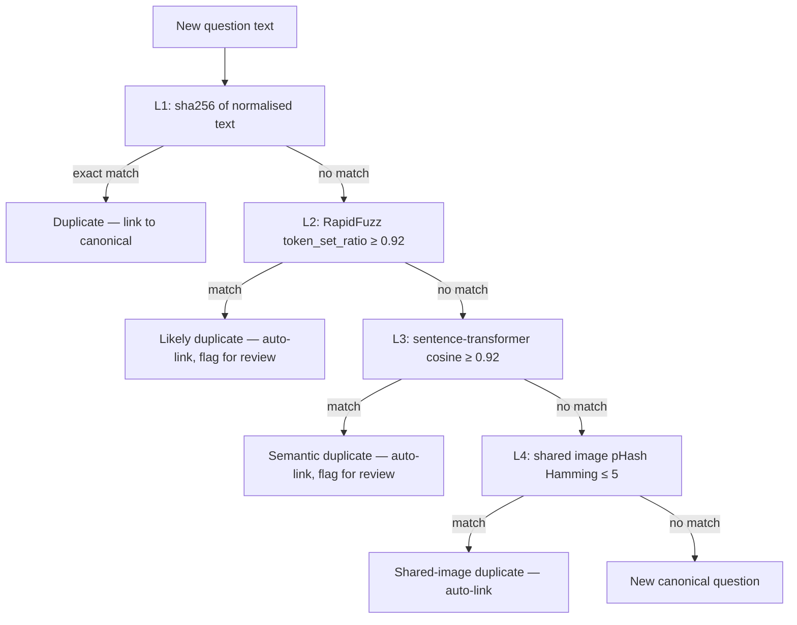

# Deduplication Plan — CrackLabs NEET PG / INI-CET Recall Bank

> Multi-level dedup: exact sha → fuzzy text → semantic embedding → image-hash. Never lose information.

---

## 1. Why dedup matters here

Recall-based NEET PG / INI-CET questions repeat heavily:

- A NEET PG 2018 question can reappear verbatim in INI-CET 2020, AIIMS PG 2019, a coaching Telegram dump, and the 2025 NEET PG.
- Bundles like "Medicine pyqs.pdf" (13 MB) and "Micro pyqs.pdf" (19 MB) likely share hundreds of stem variants.
- Without dedup the bank bloats, search rankings get noisy, and stats dashboards lie.
- With dedup done wrong, **we lose provenance** — and provenance is non-negotiable for a recall product.

So: collapse duplicates into canonical questions, but keep every source appearance as a `Provenance` row.

---

## 2. Detection levels



### 2.1 Normalisation (input to all levels)

```python
def normalise(text: str) -> str:
    text = text.lower()
    text = re.sub(r"\[(?:image|fig|figure)[^\]]*\]", " ", text)
    text = re.sub(r"\s+", " ", text)
    text = re.sub(r"\b(q|question|ans|answer|exp|explanation)\s*[:\-\.]?\s*", " ", text)
    return text.strip()
```

This removes option labels, image markers, and the punctuation noise that varies across PDFs but doesn't change meaning.

### 2.2 Level 1 — exact sha

- Compute sha256 of normalised text → 64-char hex.
- Lookup in `Question.source_text_hash` index.
- If hit → link as `DuplicateMember` with `similarity_score=1.000`, `detection_method='sha'`.

### 2.3 Level 2 — RapidFuzz

- Compute `rapidfuzz.fuzz.token_set_ratio(normalise_a, normalise_b)` for the top-K nearest neighbours by trigram.
- Threshold: `≥ 0.92` → auto-link.
- `0.85–0.92` → flag for human review.
- `< 0.85` → treat as distinct.

Fallback when `rapidfuzz` isn't installed: stdlib `difflib.SequenceMatcher` with a slightly stricter threshold.

### 2.4 Level 3 — semantic embedding

- Encode normalised text with `sentence-transformers/all-MiniLM-L6-v2` (384-dim, fast).
- Build a per-batch `IndexFlatIP` of existing canonical embeddings.
- Cosine ≥ 0.92 → auto-link.
- 0.85–0.92 → flag.

For million-question scale, swap FlatIP for `IndexIVFFlat` or a vector DB (pgvector / Qdrant / Milvus).

### 2.5 Level 4 — image-hash dedup

- For each image attached to the new question, compute pHash + dHash.
- Hamming distance ≤ 3 → exact image duplicate.
- 4–5 → near-duplicate (e.g. slight crop, watermark shift).
- If the new question's `is_image_based=True` and shares an image with an existing canonical question, link them with `similarity_score=1.000`, `detection_method='image_hash'`.

### 2.6 Cross-exam dedup

The pipeline is exam-agnostic. A NEET PG 2020 question can collapse into an INI-CET 2020 question — same canonical row, two provenance rows tagged with different `exam_id`.

---

## 3. Canonical question model

`Question.canonical_id` (uuid) is stable across the lifetime of a duplicate cluster. When two questions merge:

1. Pick the higher-confidence member as the **canonical row** (updating `Question.text`, `explanation`, etc. from the higher-quality source).
2. Add the other as a `Provenance` row — never delete it.
3. Insert a `DuplicateCluster` row + two `DuplicateMember` rows.
4. Re-link all `Option`, `Image`, `AttemptHistory`, `Bookmark`, `Discussion`, `RevisionNote` rows to point at the canonical question id (the FK is on the canonical row, not the duplicate; we keep the duplicate question row but mark `is_active=false`).

```mermaid
erDiagram
    DC[DuplicateCluster] ||--|{ CANON["Question (canonical)"] : "owns"
    DC ||--o{ DM[DuplicateMember] : "lists"
    DM ||--|{ Q[Question] : "is_a"
```

### 3.1 Why a separate question row per source

We keep every member row (even after dedup) because:

- the `attempt_history` table needs to point at the specific question the user saw (so retries don't look like easy wins);
- the `bookmark` table is per-source (a coaching bookmark is different from a NEET PG bookmark);
- the `discussion` threads should not collapse across sources.

Members are flagged with `is_active=false` and a `_duplicate_of` pointer to the canonical row, but **never deleted**.

### 3.2 Member re-activation

If a human reviewer decides two questions were wrongly merged, they re-activate the member row with a single admin action. The `DuplicateCluster` row is kept for audit.

---

## 4. Image dedup details

### 4.1 Hash chain

```
sha256  →  byte-exact duplicate (rare for scanned images)
pHash   →  robust to scaling, brightness shift (Hamming ≤ 3 = dup)
dHash   →  robust to rotation ±90° (Hamming ≤ 3 = dup)
embedding (CLIP) →  robust to cropping, partial overlap (cosine ≥ 0.95 = dup)
```

### 4.2 Storage of hashes

`ImageHashIndex` table stores `(image_id, hash_type, hash_value)` so we can switch hash types without rewriting `Image`.

### 4.3 Visual-only questions

If `Question.is_image_based = true` and `image_refs` is empty, raise `MissingImageError` — store the question with `confidence_score=0.0` and a quality flag.

If the image's pHash matches an existing image, the two questions auto-merge regardless of text similarity.

---

## 5. UI surface for dedup

- `/admin/importer/duplicatecluster/` — Django admin for manual merge / unmerge.
- User-facing: a "Sources" tab on each question shows every provenance row.
- AI Tutor responses reference the canonical question, but cite all sources.

---

## 6. Re-import safety

When a re-import runs:

1. Compute new sha256 of normalised text.
2. If a `Question` already exists with that sha256 and is_active, **do nothing** (idempotent).
3. If the question exists but is `is_active=false`, re-activate only after admin approval.
4. If the question exists with different `raw_extraction` (e.g. better OCR), update the canonical row's `confidence_score` and bump `last_seen_at`, but never overwrite `question_text`.

---

## 7. Performance budget

| Stage | Target |
|---|---|
| sha lookup | O(1) hash index |
| RapidFuzz top-K | O(log n) trigram + 50 nearest |
| Embedding search | O(log n) with IVF |
| pHash Hamming | O(1) per candidate bucket |

For 1M questions: end-to-end dedup on a single new PDF (~200 questions) should take < 5 seconds.

---

## 8. What's deliberately out of scope

- We do **not** auto-merge when similarity is borderline — we flag and queue.
- We do **not** delete duplicate question rows.
- We do **not** overwrite the canonical row's `question_text` from a lower-confidence source.
- We do **not** allow the UI to hide provenance. Every duplicate must show all sources.