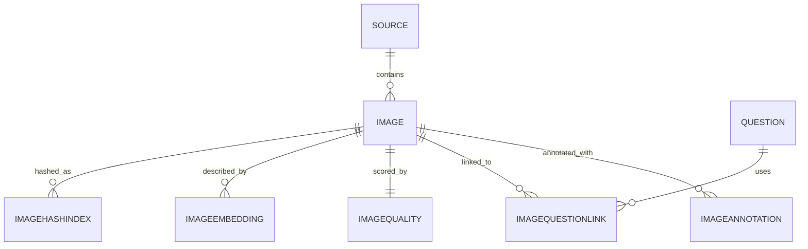

# Image Schema — CrackLabs NEET PG / INI-CET Recall Bank

> Image-first questions are first-class citizens. We never embed image bytes inside question text. Every image is hash-stamped, modality-tagged, OCR'd, captioned and linked back to its source page.

---

## 1. Goals

1. **Provenance:** every image knows its source PDF + page + index.
2. **Modality classification:** radiology / histology / ECG / clinical photo / etc. — drives filters in the UI.
3. **Visual dedup:** identical figures used in two questions collapse to one stored image with two links.
4. **High-resolution delivery:** lazy-load, responsive, zoom, fullscreen, mobile pinch-zoom.
5. **Safety & legal:** recall disclaimer surfaces on every image caption.

---

## 2. ER diagram



---

## 3. Tables

### 3.1 Image

| Column | Type | Notes |
|---|---|---|
| id | bigint pk | |
| source_id | int fk → Source | which PDF |
| page_number | int | page in source PDF |
| image_index_in_page | int | sequence on that page |
| file_path | varchar(512) | absolute local path or object-storage key |
| file_url | varchar(512) | CDN URL (when produced) |
| mime | varchar(32) | image/png, image/jpeg |
| width | int | px |
| height | int | px |
| bytes | bigint | |
| sha256 | char(64) | full content hash |
| sha256_short | char(16) | indexed |
| pHash | char(16) | perceptual hash hex |
| dHash | char(16) | difference hash hex |
| modality | varchar(32) | radiology / histopathology / gross_pathology / ecg / ct / mri / x_ray / ultrasound / clinical_photo / instrument / chart / flowchart / microbiology / slide / embryology / anatomy / biochem_pathway / dermatology / ophthalmology_fundus / other |
| modality_subtype | varchar(64) nullable | "T1 MRI" / "H&E stain" / "12-lead ECG" |
| body_region | varchar(64) nullable | chest / abdomen / knee / fundus |
| ocr_text | text | text within image (e.g. axis labels on ECG) |
| caption | text | human-or-AI description |
| caption_source | varchar(32) | in_pdf / ai_blip2 / ai_florence2 / human / none |
| ocr_confidence | numeric(4,3) | 0..1 |
| extraction_confidence | numeric(4,3) | 0..1 |
| has_diagram | bool | arrow / labels |
| has_table | bool | image contains a table |
| is_watermarked | bool | |
| recall_disclaimer_required | bool | always true on recall content |
| created_at | timestamptz | |

Indexes:
- Btree on `(source_id, page_number)`.
- Btree on `(sha256_short)` for dedup.
- Btree on `(pHash)` (or store in `ImageHashIndex` for multi-hash queries).
- Btree on `(modality)`.

### 3.2 ImageAnnotation

| Column | Type | Notes |
|---|---|---|
| id | bigint pk | |
| image_id | bigint fk → Image | |
| type | varchar(16) | arrow / box / text / callout / highlight |
| bbox_json | jsonb | `{x,y,w,h}` |
| label | varchar(120) | |

### 3.3 ImageQuestionLink

| Column | Type | Notes |
|---|---|---|
| id | bigint pk | |
| image_id | bigint fk → Image | |
| question_id | bigint fk → Question | |
| role | varchar(16) | primary / option / illustration / explanation |
| display_order | int | |

Unique: `(image_id, question_id, role)`.

### 3.4 ImageQuality

| Column | Type | Notes |
|---|---|---|
| image_id | bigint pk | |
| blur_score | numeric(6,3) | variance of Laplacian |
| contrast_score | numeric(6,3) | stddev of grayscale |
| ocr_legibility | numeric(4,3) | |
| watermark_detected | bool | |
| rotation_degrees | numeric(5,2) | auto-deskew output |
| dpi_estimate | int | from page metadata |

### 3.5 ImageEmbedding

| Column | Type | Notes |
|---|---|---|
| image_id | bigint fk → Image | |
| embedding_model | varchar(64) | "openclip-vit-b-32" / "blip-base" |
| embedding_dim | int | |
| embedding | jsonb / vector | for Postgres `pgvector` |

PK: `(image_id, embedding_model)`.

### 3.6 ImageHashIndex

| Column | Type | Notes |
|---|---|---|
| image_id | bigint fk | |
| hash_type | varchar(16) | pHash / dHash / wHash / aHash |
| hash_value | char(16) | hex |

PK: `(image_id, hash_type)`.

---

## 4. Storage layout

```
backend/importers/neetpg/_output/images/
  <source_sha16>/
    p0001_i00.png        # extracted embedded image
    p0001_i01.png
    p0002_i00.jpg
    ...
```

- Filename: `p<page>_i<index>.<ext>` — sortable, stable, dedup-friendly.
- Local disk is the staging area; the production CDN upload is a separate job (`uploader.py` future).
- Originals are **never deleted**. Re-runs produce new files under `sha16_<runid>/` so we can compare runs.

---

## 5. Modality classification

Default classifier (lightweight) uses keyword matching on the surrounding text + image filename heuristics. Output examples:

- ECG → "ECG" / "EKG" / "12-lead" / "rhythm strip" → `modality=ecg`
- X-ray → "xray" / "x-ray" / "radiograph" → `modality=x_ray`, `body_region` from caption.
- CT → "CT" / "axial CT" / "contrast CT" → `modality=ct`
- MRI → "MRI" / "T1" / "T2" / "FLAIR" → `modality=mri`, `modality_subtype` from caption.
- Histology → "H&E" / "histology" / "stain" / "biopsy" → `modality=histopathology`
- Gross specimen → "gross" / "specimen" / "cut surface" → `modality=gross_pathology`
- Flowchart → vertical tree of arrows and boxes → `modality=flowchart`
- Embryology → "embryo" / "fetal" / "week" → `modality=embryology`
- Biochemistry pathway → "pathway" / "TCA" / "glycolysis" → `modality=biochem_pathway`

Future upgrade: a small CLIP-based image classifier trained on a labelled subset will replace the keyword pass.

---

## 6. Visual dedup

1. **pHash** (perceptual hash) — robust to JPEG artefacts, scaling, brightness shift.
2. **dHash** — gradient-based, catches minor rotations.
3. **wHash** — wavelet, robust to colour shifts.
4. Hamming distance threshold: ≤ 5 → likely duplicate; ≤ 10 → near-duplicate.
5. Decision flow:
   - exact sha256 → duplicate
   - pHash Hamming ≤ 3 → duplicate
   - pHash 4–5 → flag for review
   - embedding cosine ≥ 0.95 → duplicate
6. Duplicates collapse to one `Image` row with multiple `ImageQuestionLink` rows. Source PDFs preserved per link.

---

## 7. OCR on images

- Run **tesseract** with `--psm 6` (assume a single uniform block of text) and `--psm 11` (sparse text) and pick the higher-confidence result.
- For ECG/X-ray labels: pre-process with adaptive threshold + morphology to remove gridlines before OCR.
- For histology: skip OCR; rely on caption + modality tag.

---

## 8. Caption generation

Phase 1: empty caption + `caption_source='none'`.
Phase 2: BLIP-2 or Florence-2 with a constrained prompt: *"Briefly describe this {modality} image in medical terms, max 30 words."*
Phase 3: human medical reviewer approves the top-K high-yield images.

---

## 9. Delivery

- Storage backend: local disk for dev, DigitalOcean Spaces (S3-compatible) for prod.
- CDN: Cloudflare in front of Spaces (planned).
- Variants generated per upload: `thumb` (320px), `medium` (800px), `large` (1600px), `original` (preserved).
- Lazy load: `` + intersection observer.
- Zoom: `react-medium-image-zoom` (or equivalent) with fullscreen support.
- Mobile: pinch-zoom enabled by default; user gesture preserved (no scroll hijack).

---

## 10. Quality checks

- `blur_score < 50` → flag for human review.
- `contrast_score < 20` → likely low-contrast scan.
- `is_watermarked = true` → keep image but flag in UI ("Image carries a coaching watermark").
- `rotation_degrees != 0` → rotated scan — auto-rotate display, keep original on disk.
- `dpi_estimate < 150` → low-resolution print — flag as "Image quality limited by source".

---

## 11. Out of scope (deliberately)

- We do **not** store images inside `Question` text fields.
- We do **not** delete images; we mark `is_active=False`.
- We do **not** auto-caption without modality classification.
- We do **not** display images without the recall disclaimer on the same screen.