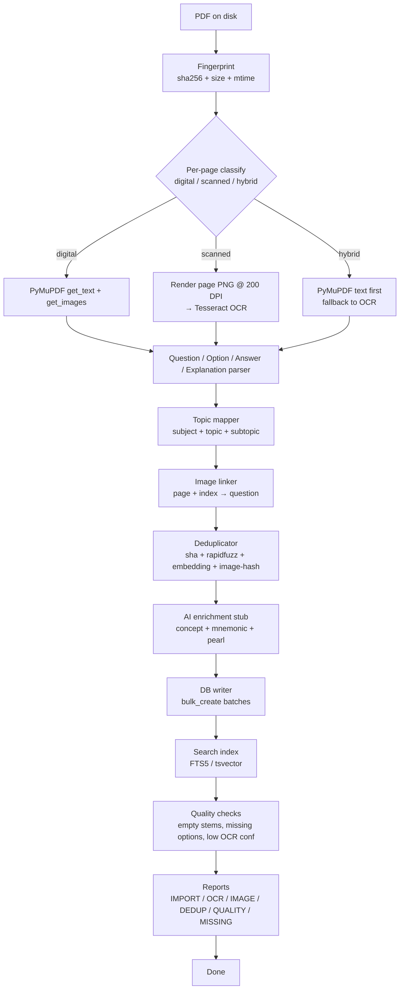

# Import Plan — NEET PG / INI-CET / AIIMS PG Recall PDFs

> Production-grade extraction pipeline: PDF → OCR/Vision → Parser → Dedup → DB → Search → Reports.
> Code lives at `backend/importers/neetpg/`. No modifications to existing production code, models, migrations, settings, or database.

---

## 1. End-to-end pipeline



---

## 2. Stage breakdown

### Stage 0 — Fingerprint

`fingerprints.compute(pdf_path)` returns:

```json
{
  "sha256": "...full hex...",
  "sha256_short": "abcdef0123456789",
  "size_bytes": ...,
  "page_count": ...,
  "is_encrypted": false
}
```

This is the **stable identity** of the source. We never re-import the same `(sha256, page_range)` twice; the manifest stores it.

### Stage 1 — Classifier

Per page we decide one of three buckets:

- **digital** — `len(text) ≥ 50` chars AND no garbled glyph ratio > 0.3.
- **scanned** — `len(text) < 50` AND `image_count > 0`.
- **hybrid** — text present but with garbled fragments; OCR supplements the text.

The decision drives whether we run OCR.

### Stage 2 — Text + image extraction

- **Digital:** `doc[page].get_text()` + `doc[page].get_images()`.
- **Scanned:** render at 200 DPI via `doc[page].get_pixmap(dpi=200)`, save as PNG, run Tesseract.
- **Hybrid:** combine text from PyMuPDF and OCR text, deduplicating overlapping fragments.

### Stage 3 — Question parser

Regex + heuristic parser (see §5). Outputs `ParsedQuestion` records:

```python
ParsedQuestion(
  number=None,
  stem="...",
  options=[ParsedOption(label="A", text="..."), ...],
  answer=["B"],
  answer_text="B",
  explanation="...",
  question_type="single_best",
  image_refs=[(page, index)],
  raw=original_chunk,
  confidence=0.93,
)
```

LLM fallback stub in `text_parser.py::parse_with_llm()` raises `NotImplementedError` with TODO; wire it to OpenAI / Cerebras / local Ollama once keys are configured.

### Stage 4 — Topic mapper

Keyword-based mapping against `topic_mapper.py::SUBJECT_KEYWORDS`. When no match, fallback to the bundle's primary subject (e.g. "Surgery pyqs.pdf" → all questions default to subject=Surgery unless a stronger keyword wins).

Future: sentence-transformer zero-shot classifier (`MoritzLaurer/deberta-v3-base-zeroshot-v2.0`) over 19 NEET PG subjects.

### Stage 5 — Image linker

For each parsed question, walk its image_refs and resolve to Image records from Stage 2. If an image can't be linked (e.g. text says "see image" but no embedded figure on the page), render the entire page region as a fallback image and link it with role=`primary`.

### Stage 6 — Deduplicator

See `DEDUPLICATION_PLAN.md`. Levels:

1. exact sha256 of normalised question text
2. rapidfuzz token_set_ratio ≥ 0.92
3. sentence-transformers cosine ≥ 0.92
4. pHash Hamming ≤ 5

### Stage 7 — AI enrichment (stub)

`enricher.py` exposes `enrich_question(question)` that currently returns `{}`. Designed to plug in concept extraction, mnemonic generation, clinical pearl generation, related-PYQ lookup via the existing RAG / KB stack. Intentionally stubbed to avoid blocking import on AI keys.

### Stage 8 — DB writer

Two paths:

- **JSONL-only path (phase 1, default):** write to `backend/importers/neetpg/_output/parsed/<sha>.questions.jsonl`. No Django model writes. Safe to re-run.
- **Django path (phase 2):** bulk_create with batch_size=500, transaction-per-source. Models live in a future `backend/importer/` Django app, added to `INSTALLED_APPS` only after stakeholder approval.

### Stage 9 — Search index

- Local: SQLite FTS5 virtual table rebuilt from JSONL.
- Prod: Postgres `tsvector` column updated on bulk_create.

### Stage 10 — Quality checks

`quality.py` flags:

- empty stems (after trim, len < 10)
- missing options (< 2)
- option count != 4 (warn, do not fail)
- ambiguous answer (multiple labels in answer_line)
- broken image refs (image_id not in current run)
- ocr confidence < MIN_OCR_CONFIDENCE (default 60)

### Stage 11 — Reports

Written under `backend/importers/neetpg/_output/reports/<run_id>/`:

- `IMPORT_REPORT.md`
- `OCR_REPORT.md`
- `IMAGE_EXTRACTION_REPORT.md`
- `DEDUPLICATION_REPORT.md`
- `QUALITY_REPORT.md`
- `MISSING_DATA_REPORT.md`

Each is a small markdown table summary.

---

## 3. Resumability & idempotency

`runner.py` writes a manifest to `backend/importers/neetpg/_output/manifest.json`:

```json
{
  "schema_version": 1,
  "runs": [
    {
      "run_id": "2026-07-22T19-30Z",
      "started_at": "...",
      "finished_at": "...",
      "processed": [
        {"sha256_short": "abc...", "page_range": [1, 230], "questions": 540, "images": 87}
      ]
    }
  ]
}
```

Re-running:

- skips any source whose `(sha256_short, page_range)` is already in a finished run.
- re-tries any source whose run failed mid-flight.

---

## 4. CLI (Django management commands)

```bash
# Inventory only — no extraction
python manage.py neetpg_scan --source-dir "C:/Users/DIVYANSHU/Desktop/crack_cms/neet-pg_and_material"

# Import one PDF
python manage.py neetpg_import --pdf "C:/.../Anatomy pyqs.pdf"

# Import every PDF in the source dir
python manage.py neetpg_import_all --source-dir "C:/..."

# Re-run dedup over previously parsed JSONL
python manage.py neetpg_dedup

# Repair low-quality rows
python manage.py neetpg_repair --min-confidence 0.70

# Generate reports from a previous run
python manage.py neetpg_report --run-id 2026-07-22T19-30Z
```

Each command supports `--dry-run`, `--limit N`, `--verbose`.

---

## 5. Question-parser design

### 5.1 Regex dictionary

```python
QUESTION_PREFIX = re.compile(
    r"(?:^|\n)\s*(?:Q\.?\s*(\d+)|Question\s+(\d+)|(\d+)[\.\)])\s*", re.IGNORECASE
)
OPTION_PREFIX   = re.compile(r"^\s*([A-F])[\.\)]\s*(.+)$", re.MULTILINE)
ANSWER_LINE     = re.compile(
    r"(?:Answer|Ans|Correct\s*answer|Key)\s*[:\-]?\s*([A-F](?:\s*[,/]\s*[A-F])*)",
    re.IGNORECASE,
)
EXPLANATION_LINE= re.compile(
    r"(?:Explanation|Explain|Exp)\s*[:\-]?\s*(.+?)(?=\n\s*(?:Q|Question|\d+\.|$))",
    re.IGNORECASE | re.DOTALL,
)
ASSERTION_REASON= re.compile(r"^Assertion\s*[:\-].*?Reason\s*[:\-]", re.IGNORECASE | re.DOTALL)
IMAGE_REF       = re.compile(r"\[(?:image|fig|figure|see\s+image)\s*(\d+)?\]", re.IGNORECASE)
```

### 5.2 Heuristics

- A page with ≥ 1 QUESTION_PREFIX matches and ≥ 4 OPTION_PREFIX matches is a question page.
- A page with ANSWER_LINE matches only is an answer-key page → merge with preceding question pages.
- A page with EXPLANATION_LINE matches only is an explanation page → merge with preceding answer-key page by question number.
- Assertion-Reason format: split stem into two halves at "Reason:" and tag `question_type='assertion_reason'`.

### 5.3 LLM fallback (stub)

```python
def parse_with_llm(page_text: str, page_no: int) -> list[ParsedQuestion]:
    raise NotImplementedError(
        "Wire to ai_engine.services.ai_complete() — pass a constrained prompt asking for JSON."
    )
```

Prompt template lives in `text_parser.py::LLM_PROMPT`.

### 5.4 Confidence

```
parse_confidence =
    0.5 * (options_detected == 4) +
    0.3 * (answer_detected) +
    0.2 * (explanation_present)
```

---

## 6. Image extraction strategy

### 6.1 Embedded

`doc[page].get_images(full=True)` → list of `(xref, smask, w, h, bpc, colorspace, alt, name, filter)`.

For each:

1. `doc.extract_image(xref)` → bytes, ext.
2. Save to `output_dir/images/<sha16>/p<page>_i<index>.<ext>`.
3. sha256, pHash, dHash.
4. OCR via tesseract on a 2× upscaled PIL.Image.
5. Return `ImageRecord(...)`.

### 6.2 Rendered

If a question's stem contains "see image" / "fig" but no embedded image was found on that page, render the page region to PNG (whole page if no bbox) and link it.

### 6.3 Multi-image pages

If a page has > 4 embedded images, demote them to `role=illustration` for the question that quotes the smallest region, and add the rest as `role=option` if any option text is short and visually references a figure.

---

## 7. Topic mapping (19 NEET PG subjects)

| Subject | Keyword seeds |
|---|---|
| Anatomy | "anatomy", "muscle", "nerve", "ligament", "artery supply", "embryology" |
| Physiology | "physiology", "action potential", "renal", "cardiac output", "hormone" |
| Biochemistry | "enzyme", "TCA", "glycolysis", "vitamin", "amino acid", "purine" |
| Pathology | "histology", "biopsy", "neoplasm", "carcinoma", "inflammation" |
| Microbiology | "bacteria", "virus", "fungal", "parasite", "stain", "culture" |
| Pharmacology | "drug", "dose", "mechanism", "side effect", "MOA", "receptor" |
| Forensic Medicine | "forensic", "postmortem", "wound", "injury", "poisoning" |
| PSM | "epidemiology", "vaccine", "screening", "public health", "biostatistics" |
| Ophthalmology | "eye", "retina", "lens", "glaucoma", "cataract", "fundus" |
| ENT | "ear", "nose", "throat", "tonsil", "sinus", "auditory" |
| General Medicine | "diabetes", "hypertension", "cardiac", "renal failure", "liver", "lung" |
| General Surgery | "hernia", "appendicitis", "trauma", "fracture", "abdomen" |
| OBG | "pregnancy", "labour", "ovary", "uterus", "menstrual" |
| Paediatrics | "neonate", "infant", "vaccination", "milestone" |
| Dermatology | "skin", "rash", "lesion", "pigmentation" |
| Orthopaedics | "bone", "joint", "fracture", "spine" |
| Anaesthesia | "anaesthesia", "intubation", "nerve block", "spinal" |
| Radiodiagnosis | "CT", "MRI", "X-ray", "USG", "radiograph", "imaging" |
| Psychiatry | "psychiatric", "depression", "schizophrenia", "anxiety" |

When no match: fallback to the bundle's primary subject from filename (e.g. `Surgery pyqs.pdf` → subject=Surgery).

---

## 8. Configuration (env-driven)

| Var | Default | Purpose |
|---|---|---|
| `NEETPG_OUTPUT_DIR` | `backend/importers/neetpg/_output` | root for raw / parsed / images / reports |
| `NEETPG_OCR_DPI` | 200 | render DPI for OCR fallback |
| `NEETPG_OCR_LANG` | `eng` | tesseract language |
| `NEETPG_BATCH_SIZE` | 500 | DB bulk_create batch |
| `NEETPG_MIN_OCR_CONFIDENCE` | 60 | quality threshold |
| `NEETPG_ENABLE_LLM_FALLBACK` | false | opt-in to AI parsing |
| `NEETPG_DEDUP_THRESHOLD` | 0.92 | fuzzy threshold |
| `NEETPG_IMAGE_PHASH_THRESHOLD` | 5 | Hamming distance |

---

## 9. Failure modes & recovery

| Failure | Recovery |
|---|---|
| PyMuPDF raises on encrypted PDF | mark source as `needs_password`, log, skip |
| Tesseract binary missing | fall back to `easyocr` if available; else mark `ocr_status=skipped` |
| Empty page text + no images | mark page as `blank`, skip |
| Option count != 4 | flag quality issue, store anyway with `option_count_warning=true` |
| Duplicate sha256 in different PDF | proceed; dedup stage collapses to canonical question |
| DB write fails mid-batch | mark run as `partial`; resume picks up next batch |
| Image file > 25 MB | downsample to fit, flag `downsampled=true` |

---

## 10. Cost / time estimates (rough)

- 26 PDFs, ~210 MB total.
- Per page: digital ~0.1 s, scanned ~1.5 s (render+OCR).
- Estimated 5000–8000 questions and 1500–3000 images after dedup.
- Single-machine runtime: ~30–90 min for OCR-heavy bundles; < 5 min for digital year papers.
- Memory: PyMuPDF + tesseract peak ~600 MB.

---

## 11. What's deliberately out of scope

- No writes to the existing production database — ever.
- No frontend changes — ever.
- No copyright scraping of Harrison/Marrow/PrepLadder — these PDFs are user-supplied recall bundles; we ingest them as the user provided.
- No auto-fixing of broken option counts — we flag and store.
- No overwriting provenance — append-only.