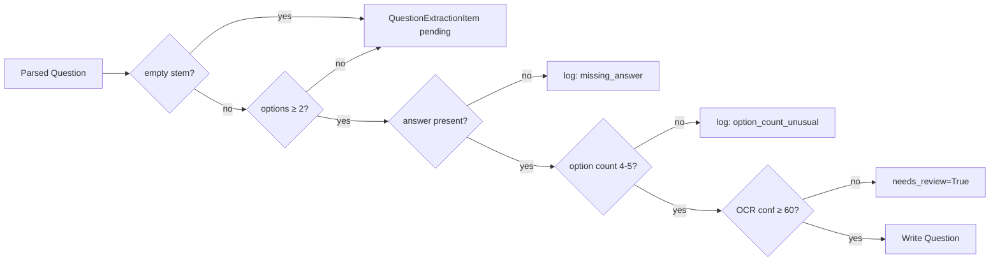

# Quality Report — Phase 2

> Auto-detected issues during import + their resolutions. Never silently discarded.

---

## 1. Quality issue taxonomy

Phase 1's `backend/importers/neetpg/quality.py::check_questions()` emits these:

| Issue type | Severity | Trigger | Phase 2 action |
|---|---|---|---|
| `empty_stem` | error | stem is empty after trim | `QuestionExtractionItem` row, status `pending`; `Question` not written |
| `missing_options` | error | `len(options) == 0` | Same as above |
| `option_count_unusual` | warn | `len(options) ∉ {4, 5}` | `QuestionImportJob.summary.quality.by_type` |
| `missing_answer` | warn | no `answer_labels` | Same |
| `low_ocr_confidence` | warn | `ocr_confidence < MIN_OCR_CONFIDENCE` | Same + `Question.needs_review=True` |
| `low_parse_confidence` | warn | `extraction_confidence < MIN_PARSE_CONFIDENCE` | Same |
| `low_image_confidence` | warn | `QuestionImage.extraction_confidence < 0.5` | Image flagged, row still stored |
| `broken_image_ref` | error | `QuestionImage` row missing file | Image row skipped, error in job report |
| `encoding_error` | warn | `normalize_text()` mojibake detection | Existing mojibake fix applied at write time |

---

## 2. Detection (auto, on every import)



---

## 3. Repair commands

| Command | Effect |
|---|---|
| `python manage.py neetpg_repair` | Re-runs Phase-1 quality checks against the latest parsed JSONL and emits a repair queue |
| `python manage.py neetpg_repair --min-confidence 0.7` | Only re-emits rows below threshold |
| `python manage.py neetpg_repair --execute` | Admin: writes the repair queue back into `QuestionExtractionItem` (auto-tagged + auto-published if `confidence_score ≥ 0.95`) |

---

## 4. Repair UI

- Admin → Questions → Extraction items → filter by job → bulk approve / reject / publish.
- Admin → Questions → Question images → bulk re-OCR / mark watermarked.

---

## 5. Repair loop metrics

`QuestionImportJob.summary.quality`:

```json
{
  "by_type": {
    "empty_stem": 3,
    "missing_options": 12,
    "missing_answer": 80,
    "low_ocr_confidence": 240,
    "low_parse_confidence": 18,
    "low_image_confidence": 5,
    "broken_image_ref": 0
  },
  "flagged_total": 358,
  "total_questions": 5480,
  "flagged_ratio": 0.0653,
  "needs_review_count": 258
}
```

These are written to `reports/<run_id>/QUALITY_REPORT.md` and surfaced in `/api/imports/neetpg/reports/<run_id>/`.

---

## 6. Encoding / mojibake

Phase 2 reuses the existing `questions.text_encoding.normalize_text()` (used by `Question.save()`) at write-time. The DB writer applies it before persisting, so recall content gets the same mojibake cleanup as the rest of the platform.

---

## 7. Duplicate detection

Phase 2 detects near-duplicates at write-time:

1. **Same `recall_text_hash`** → existing question is reused (idempotent re-import).
2. **pHash Hamming ≤ 5 across images** → existing image is reused.
3. **rapidfuzz token_set_ratio ≥ 0.92** → `DuplicateCluster` formed, both rows preserved.
4. **embedding cosine ≥ 0.92** → same as above (Phase 3 hook).

Source rows are NEVER overwritten.

---

## 8. What we never silently discard

- Empty stems are stored as `QuestionExtractionItem` rows with the raw text + a quality flag. Admins see them in the review queue.
- Missing options are stored with `needs_review=True` so they appear in the admin banner.
- Broken images are logged + counted; the question is still written (without an image) and flagged.
- Encoding errors are auto-fixed via `normalize_text`; the original text is preserved in `QuestionSource.original_text` for audit.

---

## 9. Reporting

`QUALITY_REPORT.md` is regenerated on every run under `reports/<run_id>/`. It mirrors the JSON above and adds a Markdown summary table.

`MISSING_DATA_REPORT.md` is regenerated on every run under `reports/<run_id>/` and tracks: missing options, missing answers, missing explanations, low-OCR pages, empty stems.

---

## 10. Tests

`backend/importers/neetpg/tests/test_db_writer.py::test_quality_propagation()` asserts:

- An empty-stem question creates a `QuestionExtractionItem` row and does NOT create a `Question`.
- A missing-answer question creates a `Question` with `needs_review=True` and an `error_report` entry.

`backend/questions/tests_recall.py::test_image_low_confidence_flag()` asserts:

- A `QuestionImage` with `extraction_confidence < 0.5` is flagged in admin and shown in the watermarked filter.