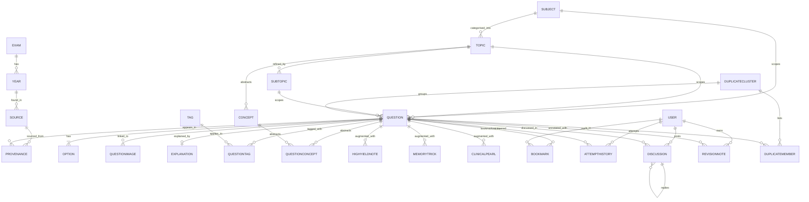

# Question Schema — CrackLabs NEET PG / INI-CET Recall Bank

> Canonical reference for the question, option, source, provenance, tag, attempt and discussion tables.
> Designed to scale from tens of thousands to **millions** of questions without schema rewrites.
> Coexists with the existing production `backend/questions/` models — this schema is the **target** design the importer writes into, and the dedicated importer app lives under `backend/importers/neetpg/`.

---

## 1. Goals

1. **Recall-safe.** Every question retains a link to its source PDF + page + OCR confidence.
2. **Provenance-first.** We never overwrite or delete; we version.
3. **Dedup-aware.** Two questions with identical text across two PDFs are stored as **one canonical question** with **two provenance rows** — both histories remain queryable.
4. **Search-first.** Full-text + semantic + faceted (subject/topic/year/exam/difficulty/modality) from day 1.
5. **AI-friendly.** Each question carries slots for concept, mnemonic, clinical pearl, related PYQs.

---

## 2. ER diagram



---

## 3. Tables

### 3.1 Exam

| Column | Type | Notes |
|---|---|---|
| id | int pk | |
| code | varchar(32) unique | NEET_PG / INI_CET / AIIMS_PG |
| name | varchar(120) | "NEET PG (National Eligibility cum Entrance Test – Post Graduate)" |
| conducting_body | varchar(120) | NBE / AIIMS |
| default_question_count | int | typical paper size |
| is_active | bool | |

### 3.2 Year

| Column | Type | Notes |
|---|---|---|
| id | int pk | |
| exam_id | int fk → Exam | |
| year | int | 2018…2025 |
| session | varchar(16) | jan/jul/may/nov/none |
| recall_status | varchar(32) | official_compiled / recall / coaching_compiled |
| source_label | varchar(255) | "NEET-PG-2021-Question-Paper-With-Solutions" |
| is_active | bool | |

Unique: `(exam_id, year, session)`.

### 3.3 Subject

| Column | Type | Notes |
|---|---|---|
| id | int pk | |
| name | varchar(120) | Anatomy |
| slug | varchar(64) unique | anatomy |
| exam_tags | varchar(255) csv | NEET_PG,INI_CET,AIIMS_PG |
| is_clinical | bool | derived |
| display_order | int | |

### 3.4 Topic

| Column | Type | Notes |
|---|---|---|
| id | int pk | |
| subject_id | int fk → Subject | |
| name | varchar(120) | Cardiology |
| slug | varchar(120) | cardiology |
| parent_topic_id | int fk → Topic nullable | hierarchy |

Unique: `(subject_id, slug)`.

### 3.5 Subtopic

| Column | Type | Notes |
|---|---|---|
| id | int pk | |
| topic_id | int fk → Topic | |
| name | varchar(160) | ACS |
| slug | varchar(160) | acs |

Unique: `(topic_id, slug)`.

### 3.6 Source

| Column | Type | Notes |
|---|---|---|
| id | int pk | |
| pdf_filename | varchar(255) | |
| pdf_path | varchar(512) | absolute |
| pdf_sha256 | char(64) | full hash |
| pdf_sha256_short | char(16) | indexed |
| pdf_size_bytes | bigint | |
| page_count | int | |
| page_start | int | first page used |
| page_end | int | last page used |
| question_count | int | post-parse |
| scan_type | varchar(16) | digital / scanned / hybrid |
| recall_status | varchar(32) | recall / coaching_compiled / official_compiled |
| publisher | varchar(160) nullable | "Marrow / PrepLadder / DB-Centric / Unknown" |
| imported_at | timestamptz | |
| importer_version | varchar(32) | git sha of importer |
| notes | text | |

Unique: `(pdf_sha256, page_start, page_end)`.

### 3.7 Question

| Column | Type | Notes |
|---|---|---|
| id | bigint pk | autoincrement |
| canonical_id | uuid unique | external handle for dedup cluster |
| question_text | text | normalised |
| question_text_raw | text | original extraction (may contain OCR artefacts) |
| question_type | varchar(32) | single_best / multiple_correct / assertion_reason / match / image_based / numerical |
| clinical_category | varchar(32) | clinical / preclinical / paraclinical |
| difficulty | varchar(16) | easy / medium / hard / expert |
| recall_status | varchar(32) | recall / coaching_compiled / official_compiled |
| language | varchar(8) | en |
| source_text_hash | char(64) | sha256 of normalised text — dedup key |
| confidence_score | numeric(4,3) | 0.000–1.000 (parse + OCR + image) |
| is_active | bool | soft delete |
| is_image_based | bool | image required to answer |
| is_high_yield | bool | curated |
| first_seen_at | timestamptz | |
| last_seen_at | timestamptz | |
| raw_extraction | jsonb | full extract blob for reprocessing |
| created_at | timestamptz | |
| updated_at | timestamptz | |

Indexes:
- `ix_question_subject` (subject_id) — but kept as Topic-level link.
- GIN/trigram index on `question_text` (production Postgres) for fuzzy search.
- Btree on `(source_text_hash)` — dedup.
- Btree on `(confidence_score)` — quality filter.
- Partial index on `is_image_based = true` — image-bank queries.

### 3.8 Option

| Column | Type | Notes |
|---|---|---|
| id | bigint pk | |
| question_id | bigint fk → Question ON DELETE RESTRICT | |
| label | char(2) | A / B / C / D / E / F |
| text | text | |
| is_correct | bool | |
| image_refs | jsonb | array of image_ids referenced from this option |

Unique: `(question_id, label)`.

### 3.9 QuestionImage (link)

| Column | Type | Notes |
|---|---|---|
| question_id | bigint fk → Question | |
| image_id | bigint fk → Image | |
| role | varchar(16) | primary / option / illustration / explanation |
| page_in_pdf | int | |
| bbox_or_position | varchar(64) | "top-half", or "x,y,w,h" |
| display_order | int | |

PK: `(question_id, image_id, role)`.

### 3.10 Explanation

| Column | Type | Notes |
|---|---|---|
| id | bigint pk | |
| question_id | bigint fk → Question | |
| text | text | |
| source | varchar(32) | in_pdf / ai_generated / external |
| author | varchar(120) nullable | reviewer handle |
| medical_review_status | varchar(32) | pending / approved / rejected / not_required |
| reviewed_by | varchar(120) nullable | |
| reviewed_at | timestamptz nullable | |

One row per `(question_id, source)` is allowed (e.g. one in_pdf, one ai_generated).

### 3.11 Concept

| Column | Type | Notes |
|---|---|---|
| id | int pk | |
| name | varchar(160) | STEMI |
| slug | varchar(160) unique | stemi |
| description | text | |
| system | varchar(32) | cardio / resp / gi / endo / … |
| high_yield | bool | |

### 3.12 Tag

| Column | Type | Notes |
|---|---|---|
| id | int pk | |
| name | varchar(120) | |
| slug | varchar(120) unique | |
| category | varchar(32) | high_yield / clinical_pearl / memory_trick / repeated / drug / investigation / finding / diagnosis |

### 3.13 QuestionTag

| Column | Type | Notes |
|---|---|---|
| question_id | bigint fk | |
| tag_id | int fk | |
| weight | numeric(4,3) | relevance 0..1 |

PK: `(question_id, tag_id)`.

### 3.14 QuestionConcept

| Column | Type | Notes |
|---|---|---|
| question_id | bigint fk | |
| concept_id | int fk | |

PK: `(question_id, concept_id)`.

### 3.15 HighYieldNote

| Column | Type | Notes |
|---|---|---|
| id | bigint pk | |
| question_id | bigint fk | |
| text | text | |
| source | varchar(32) | in_pdf / ai_generated / editor |
| created_at | timestamptz | |

### 3.16 MemoryTrick

| Column | Type | Notes |
|---|---|---|
| id | bigint pk | |
| question_id | bigint fk | |
| text | text | mnemonic body |
| source | varchar(32) | in_pdf / ai_generated / user |
| mnemonic_type | varchar(32) | acronym / rhyme / visual / story |
| created_at | timestamptz | |

### 3.17 ClinicalPearl

| Column | Type | Notes |
|---|---|---|
| id | bigint pk | |
| question_id | bigint fk | |
| text | text | |
| created_at | timestamptz | |

### 3.18 BookMark

| Column | Type | Notes |
|---|---|---|
| id | bigint pk | |
| user_id | int fk → accounts_customuser | per project user model |
| question_id | bigint fk → Question | |
| note | text | |
| created_at | timestamptz | |

Unique: `(user_id, question_id)`.

### 3.19 AttemptHistory

| Column | Type | Notes |
|---|---|---|
| id | bigint pk | |
| user_id | int fk → accounts_customuser | |
| question_id | bigint fk → Question | |
| selected_options | jsonb | array of labels |
| is_correct | bool | |
| time_seconds | int | |
| mode | varchar(16) | test / practice / revision / rapid_review / clinical_mode |
| attempted_at | timestamptz | |

Index: `(user_id, attempted_at desc)`, `(question_id)`.

### 3.20 Discussion

| Column | Type | Notes |
|---|---|---|
| id | bigint pk | |
| question_id | bigint fk | |
| user_id | int fk → accounts_customuser | |
| body | text | markdown |
| parent_discussion_id | bigint fk → Discussion nullable | thread |
| upvotes | int | denormalised |
| created_at | timestamptz | |

### 3.21 RevisionNote

| Column | Type | Notes |
|---|---|---|
| id | bigint pk | |
| user_id | int fk | |
| question_id | bigint fk | |
| body | text | |
| updated_at | timestamptz | |

Unique: `(user_id, question_id)`.

### 3.22 Provenance

| Column | Type | Notes |
|---|---|---|
| id | bigint pk | |
| question_id | bigint fk → Question | |
| source_id | int fk → Source | |
| page_number | int | page in source PDF |
| question_number_in_pdf | int nullable | "Q.45" inside the source |
| original_text | text | raw extracted text |
| extracted_text | text | post-normalised text |
| ocr_confidence | numeric(4,3) | OCR engine score |
| extraction_confidence | numeric(4,3) | parse confidence |
| import_job_id | varchar(64) | run id of the importer |
| imported_at | timestamptz | |

Index: `(source_id, page_number)`, `(question_id)`.

### 3.23 DuplicateCluster

| Column | Type | Notes |
|---|---|---|
| id | bigint pk | |
| canonical_question_id | bigint fk → Question | |
| similarity_threshold | numeric(4,3) | 0.92 |
| detection_method | varchar(32) | sha / rapidfuzz / embedding / image_hash |
| created_at | timestamptz | |

### 3.24 DuplicateMember

| Column | Type | Notes |
|---|---|---|
| cluster_id | bigint fk → DuplicateCluster | |
| question_id | bigint fk → Question | |
| similarity_score | numeric(4,3) | |

PK: `(cluster_id, question_id)`.

---

## 4. Indexes summary (Django ORM sketch)

```python
class Meta:
    indexes = [
        models.Index(fields=["source_text_hash"], name="ix_question_text_hash"),
        models.Index(fields=["confidence_score"], name="ix_question_conf"),
        models.Index(fields=["is_image_based"], name="ix_question_img"),
        models.Index(fields=["last_seen_at"], name="ix_question_seen"),
        models.GinIndex(fields=["question_text"], name="ix_question_text_gin"),
    ]
```

For SQLite dev: FTS5 virtual table over `question_text` + `option_text`.

For production Postgres: `tsvector` + `pg_trgm` GIN + `ivfflat`/`hnsw` over an embedding column (added later by the AI enrichment pass).

---

## 5. Soft-delete & version policy

- `is_active=False` on a Question = retired, never deleted. Membership in a duplicate cluster is preserved.
- Schema rewrites go through additive migrations only. We never drop a column; we add `_v2` columns when the meaning shifts.
- Old `original_text` rows live forever in `Provenance.original_text`.

---

## 6. Partitioning strategy for million-question scale

- `Question` table is range-partitioned by `created_at` per year (Postgres native partitioning). Old partitions stay read-only.
- `AttemptHistory` is range-partitioned by `attempted_at` per quarter.
- `Provenance` is range-partitioned by `imported_at` per quarter.
- `Image` stays unpartitioned but indexed by `(source_id, page_number)` and `(pHash)`.

---

## 7. Full-text search plan

- Local dev (SQLite): FTS5 virtual table over `question_text`, joined to `Question` by rowid.
- Production (Postgres): generated `tsvector` column with weights A (question_text) / B (option_text) / C (explanation), GIN-indexed.
- Semantic: a `QuestionEmbedding` table holds `model_name`, `embedding_dim`, `embedding` (`vector(384)` for MiniLM / `vector(1024)` for bge-large) — added in a later AI-enrichment pass.

---

## 8. Confidence & provenance scoring

```
question.confidence_score =
    0.40 * ocr_confidence                # if scanned, else 1.0
  + 0.30 * parse_confidence              # regex hit + structural validation
  + 0.15 * option_completeness           # 4/4 = 1.0, 3/4 = 0.75, <3 = 0.0
  + 0.10 * answer_present                # 1.0 if answer detected
  + 0.05 * image_link_integrity          # 1.0 if no broken image refs
```

`provenance.ocr_confidence` is the raw OCR score from tesseract / easyocr.
`provenance.extraction_confidence` is the parse-stage score.

---

## 9. Migration plan

1. **Phase 1** — scaffold the importer app at `backend/importers/neetpg/` with JSONL output. No new Django models yet. (Done — see code drop.)
2. **Phase 2** — add `Importer` models to a new `backend/importer/` Django app under `INSTALLED_APPS` only after stakeholder approval. Initial migration only creates `Source` + `ImportJob` + `RawQuestion`.
3. **Phase 3** — add `Question`, `Option`, `QuestionImage`, `Explanation`, `Provenance`, `Image`, `Tag`, `Concept`.
4. **Phase 4** — add `Bookmark`, `AttemptHistory`, `Discussion`, `RevisionNote`.
5. **Phase 5** — add `DuplicateCluster`, `DuplicateMember`.
6. **Phase 6** — add `QuestionEmbedding` (vector column) after the AI enrichment pass.

Each phase is additive and tested in isolation.

---

## 10. Out of scope (deliberately)

- We do **not** delete questions — soft-delete via `is_active` only.
- We do **not** overwrite provenance — `Provenance` rows are append-only.
- We do **not** surface provider/model error strings in the UI.
- We do **not** claim recall-based content is official. The disclaimer is mandatory.