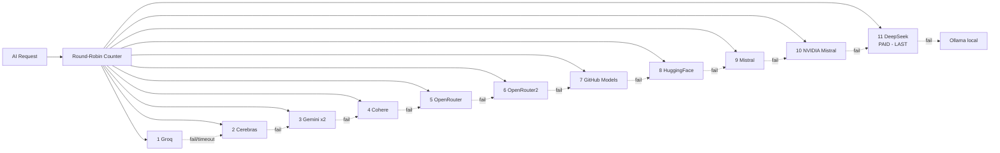

# AI Providers Setup

> Single canonical guide to all **11 AI providers + Ollama fallback** in CrackCMS.
> Consolidates the former `API_KEYS.md`, `NVIDIA_MISTRAL_SETUP.md`, and `OLLAMA_SETUP.md`.

---

## Overview

CrackCMS uses **11 cloud AI providers** in a round-robin rotation, with **Ollama (local)** as the final fallback. Each provider has different quota limits; missing keys are silently skipped.



**Time budget**: 120 s per request, 15–20 s per provider.

---

## Environment Variables

Add to `backend/.env` (git-ignored):

```env
# Cloud AI providers (free tier)
GROQ_API_KEY=gsk_...
CEREBRAS_API_KEY=csk-...
GEMINI_API_KEY=AIza...
GITHUB_TOKEN=ghp_...
OPENROUTER_API_KEY=sk-or-...
OPENROUTER_API_KEY2=sk-or-...
COHERE_API_KEY=...

# Additional free providers (graceful skip if missing)
HUGGINGFACE_API_KEY=hf_...
MISTRAL_API_KEY=...
NVIDIA_MISTRAL_API_KEY=nvapi-...

# Paid (try last)
DEEPSEEK_API_KEY=sk-...

# Local fallback (no key)
OLLAMA_MODEL=llama3.2:3b
```

**Operational proven floor (live today)**: 60 RPM, 15,400 RPD (Groq + Cerebras). Operational conservative (incl. GitHub + Cohere): 95 RPM, 15,550 RPD. See [`reference/DEPLOYMENT_CAPACITY.md`](../reference/DEPLOYMENT_CAPACITY.md) for current measurements.

---

## Provider Setup

### 1. Groq (Free — 30 RPM, 14,400 RPD)
- **Model**: `llama-3.3-70b-versatile`
- **Sign up**: https://console.groq.com
- **Get key**: Console → API Keys → Create
- **Env**: `GROQ_API_KEY=gsk_...`

### 2. Cerebras (Free — 30 RPM, ~1M tok/day)
- **Model**: `gemma-4-31b` (verified from `services.py:382`)
- **Sign up**: https://cloud.cerebras.ai
- **Get key**: Dashboard → API Keys
- **Env**: `CEREBRAS_API_KEY=csk-...`

### 3. Google Gemini (Free — 15 RPM, 1,500 RPD per model)
- **Models**: `gemini-2.0-flash`, `gemini-2.0-flash-lite`
- **Sign up**: https://aistudio.google.com
- **Get key**: API Keys → Create
- **Env**: `GEMINI_API_KEY=AIza...`

### 4. Cohere (Free trial — 20 RPM)
- **Model**: `command-a-03-2025`
- **Sign up**: https://dashboard.cohere.com
- **Get key**: API Keys → Create Trial Key
- **Env**: `COHERE_API_KEY=...`

### 5 & 6. OpenRouter (Free — 20 RPM each)
- **Models**: free variants (Meta Llama 3 8B, Mistral 7B, etc.)
- **Sign up**: https://openrouter.ai
- **Get key**: Dashboard → API Keys (create 2 keys for `OPENROUTER_API_KEY` and `OPENROUTER_API_KEY2`)
- **Env**:
  ```env
  OPENROUTER_API_KEY=sk-or-v1-...
  OPENROUTER_API_KEY2=sk-or-v1-...
  ```

### 7. GitHub Models (Free — 15–150 RPM)
- **Model**: `openai/gpt-4o-mini` (low tier default)
- **Sign up**: https://github.com/settings/tokens
- **Get key**: Generate Personal Access Token (classic) with no special scopes
- **Env**: `GITHUB_TOKEN=ghp_...`

### 8. HuggingFace (Free — ~10 RPM)
- **Model**: Llama 3.3 70B
- **Sign up**: https://huggingface.co
- **Get key**: Settings → Access Tokens
- **Env**: `HUGGINGFACE_API_KEY=hf_...`

### 9. Mistral (Free — ~30 RPM)
- **Model**: `mistral-small`
- **Sign up**: https://console.mistral.ai
- **Get key**: API Keys → Create
- **Env**: `MISTRAL_API_KEY=...`

### 10. NVIDIA Mistral (Free tier via NVIDIA API platform)
- **Model**: `mistralai/mistral-7b-instruct-v0.2`
- **Sign up**: https://build.nvidia.com/
- **Get key**: API keys → Generate (format `nvapi-...`)
- **Env**: `NVIDIA_MISTRAL_API_KEY=nvapi-...`

### 11. DeepSeek (Pay-as-you-go, tried LAST)
- **Model**: `deepseek-chat`
- **Sign up**: https://platform.deepseek.com
- **Get key**: API keys → Create (requires account balance)
- **Env**: `DEEPSEEK_API_KEY=sk-...`
- **Cost**: ~$0.14/1M input tokens
- **Note**: Only triggered when all 10 above providers fail or are rate-limited.

### Fallback: Ollama (Local — unlimited)
- **Default model**: `llama3.2:3b` (~2 GB)
- **Install**:
  - Windows: Download from https://ollama.com/download/windows
  - macOS: `brew install ollama && ollama serve`
  - Linux: `curl -fsSL https://ollama.com/install.sh | sh && ollama serve`
- **Pull model**: `ollama pull llama3.2:3b`
- **Verify**: `curl http://localhost:11434/api/tags`
- **Env** (optional): `OLLAMA_MODEL=llama3.1:8b` to use a different model
- **Other models**: `llama3.1:8b` (5 GB), `gemma2:9b` (5 GB), `mistral:7b` (4 GB)

---

## Round-Robin Behavior

### Actual rotation order (verified from `services.py:686-694`)

The `_call_ai` rotation list contains **9 providers** in this exact order:

1. **Groq** — `llama-3.3-70b-versatile` (15 s timeout)
2. **Cerebras** — `gemma-4-31b` (15 s timeout, ThreadPoolExecutor)
3. **Gemini** — 2-model fallback (`gemini-2.0-flash` → `gemini-2.0-flash-lite`, 15 s each)
4. **Cohere** — `command-a-03-2025` (15 s timeout, ThreadPoolExecutor)
5. **OpenRouter** — 4 free models tried in sequence (`llama-3.3-70b`, `gemma-3-27b`, `qwen-2.5-72b`, `mistral-7b`)
6. **GitHub Models** — `gpt-4o-mini` (15 s timeout)
7. **HuggingFace** — `meta-llama/llama-3.3-70b-instruct` via Novita router (`https://router.huggingface.co/novita/v3/openai`, 20 s)
8. **Mistral** — `mistral-small-latest` (15 s)
9. **OpenRouter2** — 2 free models tried in sequence (`gemma-2-9b`, `phi-3-medium`)

**Important**: NVIDIA Mistral and DeepSeek clients are **initialized** if their keys are present, but they are **NOT** in the `_call_ai` rotation list. They are reserved for future use or admin direct-calls.

### Selection algorithm
- Round-robin counter (`threading.Lock`) increments per request — `_call_counter % 9` picks starting index
- Up to 9 providers tried in rotation starting from that index
- Each provider has a 15–20 s timeout
- `_PROVIDER_ERROR_PHRASES` filter rejects responses containing "no auto mode endpoints provided", "model endpoint not found", "service unavailable", "upstream request failed", "gateway timeout", "no endpoints provided"

### Per-request deadline
- **120 s** total (`deadline = time.time() + 120` in `_call_ai`)
- **15–20 s** per provider
- All 9 fail → return "All AI services are temporarily unavailable. Please try again in a moment." (NOT Ollama — Ollama is not in the AI service; it's a separate local model the user can run, not integrated into the round-robin)
- Per-provider self-disable: if a provider returns 401/403, `self.<provider> = None` to skip it for the rest of the session

### Fallback (production)
- **RAG is disabled in production** — `if not settings.DEBUG: return None` in the `rag` property (line 282 of `services.py`)
- `DISABLE_RAG=1` also disables RAG even in dev

---

## Testing

```bash
cd backend
python test_api_keys.py           # Tests all configured providers, prints ✅/❌
python test_all.py --quick        # Skip slow AI tests
python test_all.py --auth-only    # Auth flow only
```

Expected output for `test_api_keys.py`:
```
✅ GROQ_API_KEY set
✅ Groq: 200 OK (1.2 s)
✅ CEREBRAS_API_KEY set
✅ Cerebras: 200 OK (0.8 s)
...
❌ DEEPSEEK_API_KEY not set (skipped)
✅ Ollama: 200 OK (2.5 s)
```

---

## Health check endpoint

`GET /api/ai/status/` returns per-provider health (used by frontend admin dashboard):

```json
{
  "providers": [
    { "name": "Groq", "healthy": true, "last_used": "2026-07-20T10:00:00Z", "cooldown_until": null },
    { "name": "Cerebras", "healthy": true, ... },
    { "name": "DeepSeek", "healthy": false, "cooldown_until": "2026-07-20T10:05:00Z" }
  ],
  "current_index": 3
}
```

---

## Security

- ⚠️ **Never commit API keys** — `.env` is git-ignored; pre-commit hook blocks leaks.
- ⚠️ **Rotate any key that has appeared in public docs/git history** — see [`reference/SECURITY_SECRETS.md`](../reference/SECURITY_SECRETS.md).
- ⚠️ **Set per-provider quotas** in your dashboards to prevent runaway costs (especially DeepSeek).
- ⚠️ **Monitor Datadog APM** for unusual spikes in provider errors.

---

## Troubleshooting

| Symptom | Cause | Fix |
|---|---|---|
| All providers fail, only Ollama works | Cloud API keys invalid or quota exhausted | Run `python test_api_keys.py`; rotate keys |
| Provider returns 429 | Rate limit hit | Wait for cooldown or rotate keys |
| DeepSeek returns 402 | No balance | Add funds at https://platform.deepseek.com |
| Ollama "connection refused" | Local server not running | `ollama serve` |
| Ollama slow (>30 s) | Model too large for hardware | Use `llama3.2:3b` instead of 70B |
| Provider returns "endpoint not found" | Model name changed by provider | Check provider's docs; update `services.py` |
| Gemini 0 RPM | Project tier limits hit | Check AI Studio → project quota |

---

## When a provider is deprecated

1. Mark as deprecated in `services.py` (set `_DEPRECATED_PROVIDERS`)
2. Remove from provider list
3. Remove from `requirements.txt` SDK
4. Remove from `backend/.env.example`
5. Update `docs/setup/AI_PROVIDERS.md` (this file)
6. Update [`docs/ARCHITECTURE.md` § AI Architecture](../ARCHITECTURE.md#4-ai-architecture)
7. Update [`docs/PROJECT_OVERVIEW.md` § AI Integrations](../PROJECT_OVERVIEW.md)
