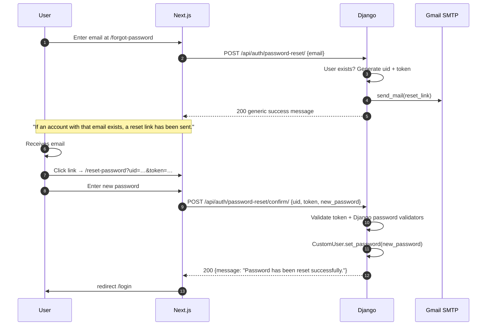

# Email Setup — Gmail SMTP + Password Reset

> Single canonical guide for password-reset email and Gmail SMTP configuration.
> Consolidates the former `GMAIL_SETUP.md` and `PASSWORD_RESET_SETUP.md`.

---

## Overview

CrackCMS uses Gmail SMTP to send password-reset emails. The system is **dual-mode**: when `EMAIL_HOST_PASSWORD` is set, real SMTP is used; when empty, the Django console backend prints emails to the server log (for development).

**Email backend selection** (`backend/crack_cms/settings.py`):
```python
if EMAIL_HOST_PASSWORD and EMAIL_HOST_PASSWORD.strip():
    EMAIL_BACKEND = 'django.core.mail.backends.smtp.EmailBackend'
else:
    EMAIL_BACKEND = 'django.core.mail.backends.console.EmailBackend'
```

This means **no code change is needed between dev and prod** — just flip the env var.

---

## Hosting Caveats

| Hosting | SMTP port 25/465/587 | Workaround |
|---|---|---|
| **Render free** | ❌ Blocked | Use Render paid + port 587; or use API |
| **Render paid** | ⚠ Some restrictions | Use SendGrid / Mailgun / Postmark API |
| **DigitalOcean** | ❌ Blocked by default | Use SendGrid / Mailgun API |
| **Local dev** | ✓ Use Gmail SMTP directly | |
| **Custom VPS** | ✓ Usually OK | |

**Recommended for production**: Replace Gmail SMTP with an email API provider (SendGrid, Mailgun, Postmark, AWS SES). See "Production migration" below.

---

## Step 1 — Enable 2-Step Verification

1. Go to https://myaccount.google.com/security
2. Under "How you sign in to Google", enable **2-Step Verification**
3. Complete the setup process

---

## Step 2 — Create a Gmail App Password

1. Go to https://myaccount.google.com/apppasswords
2. Select **Mail** as the app
3. Select **Other (Custom name)** → enter "CrackCMS"
4. Click **Generate**
5. Copy the 16-character password (e.g. `abcd efgh ijkl mnop`)
6. **Remove spaces** before pasting into `.env`

---

## Step 3 — Environment Variables

### Local development (`backend/.env`)

```env
EMAIL_HOST_USER=crackwith.ai@gmail.com
EMAIL_HOST_PASSWORD=abcdefghijklmnop
DEFAULT_FROM_EMAIL=CrackCMS <crackwith.ai@gmail.com>
FRONTEND_URL=http://localhost:3000
EMAIL_TIMEOUT=20
```

If `EMAIL_HOST_PASSWORD` is empty, emails print to the Django console — perfect for dev.

### Production (Render / DigitalOcean)

In your hosting dashboard → Environment:

```
EMAIL_HOST_USER=crackwith.ai@gmail.com
EMAIL_HOST_PASSWORD=abcdefghijklmnop
DEFAULT_FROM_EMAIL=CrackCMS <crackwith.ai@gmail.com>
FRONTEND_URL=https://cracklabs.app
EMAIL_TIMEOUT=20
```

### Production (Render free tier — SMTP blocked!)

Free tier blocks outbound SMTP. Either:
- Upgrade to Render paid instance, OR
- Switch to email API (recommended):

```env
EMAIL_BACKEND=anymail.backends.mailgun.EmailBackend
ANYMAIL_MAILGUN_API_KEY=key-...
ANYMAIL_MAILGUN_SENDER_DOMAIN=mg.cracklabs.com
DEFAULT_FROM_EMAIL=CrackCMS <hello@mg.cracklabs.com>
```

---

## Step 4 — Test

### Quick backend test

```bash
cd backend
python manage.py shell
from django.core.mail import send_mail
send_mail(
    'Test',
    'Hello from CrackCMS',
    'crackwith.ai@gmail.com',
    ['your-test-email@example.com'],
    fail_silently=False,
)
```

### End-to-end test

1. Start backend: `python manage.py runserver`
2. Start frontend: `npm run dev`
3. Go to `/login` → Click "Forgot password?"
4. Enter your email and click "Send Reset Link"
5. Check your inbox (or Django console in dev) for the reset email

---

## Password Reset Flow



### Security features

- **Generic success response** prevents email enumeration
- **Cryptographically secure tokens** (Django's `default_token_generator`)
- **24-hour expiry** (Django default)
- **Django password validators** enforce 8+ chars + complexity
- **HTTPS-ready** — reset links use `FRONTEND_URL`

---

## API Reference

| Method | Path | Body | Response |
|---|---|---|---|
| POST | `/api/auth/password-reset/` | `{ "email": "..." }` | `200 { "message": "If an account with that email exists, a reset link has been sent." }` |
| POST | `/api/auth/password-reset/confirm/` | `{ "uid": "...", "token": "...", "new_password": "..." }` | `200 { "message": "Password has been reset successfully." }` |

See [`API_REFERENCE.md`](../API_REFERENCE.md) for the full spec.

---

## Production Migration Plan (Gmail → API)

Recommended provider: **SendGrid** (best deliverability) or **Mailgun** (cheapest).

### Why migrate

- Gmail SMTP is **not designed for transactional email** at scale
- Daily limit: ~500 emails/day for free Gmail
- SPF/DKIM setup is complex with Gmail
- API providers offer: tracking, templates, bounce handling

### Migration steps

1. Sign up at SendGrid / Mailgun
2. Verify your sending domain
3. Install `django-anymail`: `pip install django-anymail[sendgrid]`
4. Update `settings.py`:
   ```python
   INSTALLED_APPS = [..., 'anymail']
   ANYMAIL = {
       'SENDGRID_API_KEY': os.getenv('SENDGRID_API_KEY'),
   }
   EMAIL_BACKEND = 'anymail.backends.sendgrid.EmailBackend'
   ```
5. Test password reset end-to-end
6. Monitor deliverability in SendGrid dashboard

---

## Troubleshooting

| Symptom | Fix |
|---|---|
| "Username and Password not accepted" (535) | Verify Gmail App Password; ensure 2FA enabled |
| Email not received | Check spam; verify `EMAIL_HOST_PASSWORD` has no spaces |
| "SMTPAuthenticationError" | Regenerate App Password; update `.env` |
| Connection timeout on Render free | Upgrade Render instance OR switch to email API |
| Reset link goes to localhost | Verify `FRONTEND_URL` env var |
| Token expired | Request a new link (24h expiry) |
| Email goes to spam | Set up SPF/DKIM records (Gmail domain verification) |

---

## Security Notes

- ⚠️ **Never paste live App Password in docs, code, or git** — env vars only.
- ⚠️ **Rotate App Password periodically** — every 90 days recommended.
- ⚠️ **Enable 2FA on the Gmail account** — required for App Passwords.
- ⚠️ **Use a dedicated Gmail account** for transactional email, not a personal one.
- ⚠️ **Never reuse Gmail password** — App Passwords are scoped to the app.
- See [`reference/SECURITY_SECRETS.md`](../reference/SECURITY_SECRETS.md) for full secret-handling policy.

---

## See Also

- [`API_REFERENCE.md`](../API_REFERENCE.md) — endpoint specs
- [`AUTHENTICATION.md`](../AUTHENTICATION.md) — full auth flow
- [`SECURITY_AUDIT.md`](../SECURITY_AUDIT.md) — security posture
- [`reference/SECURITY_SECRETS.md`](../reference/SECURITY_SECRETS.md) — secret rotation
